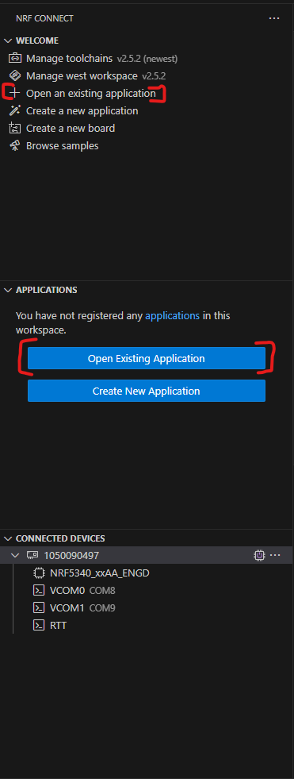
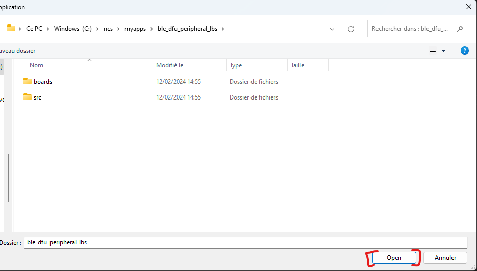
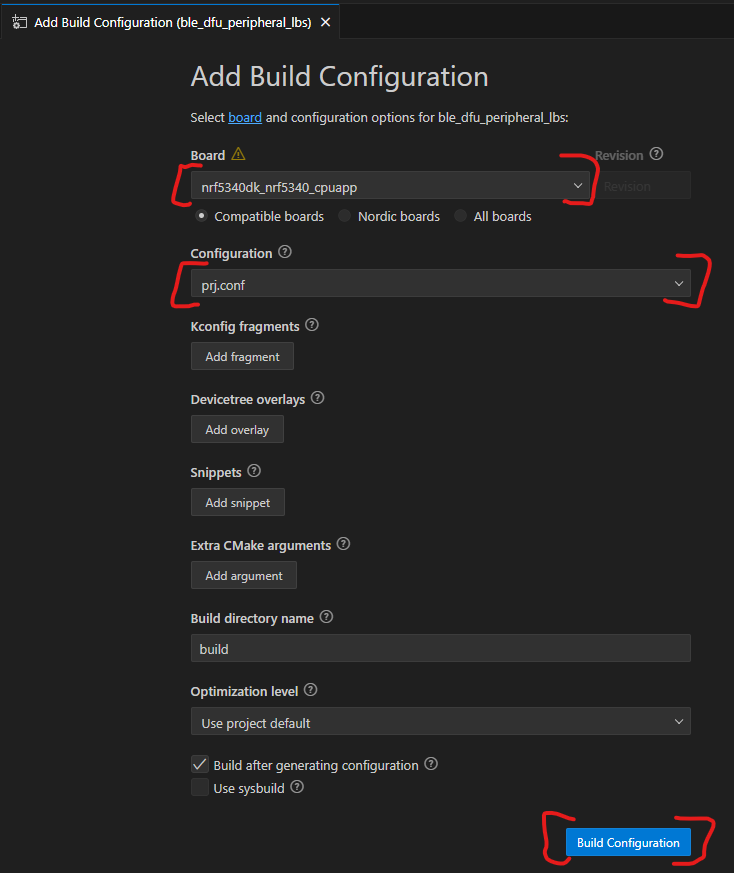
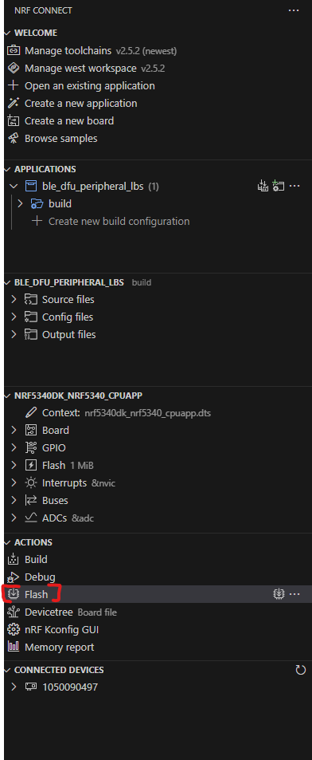
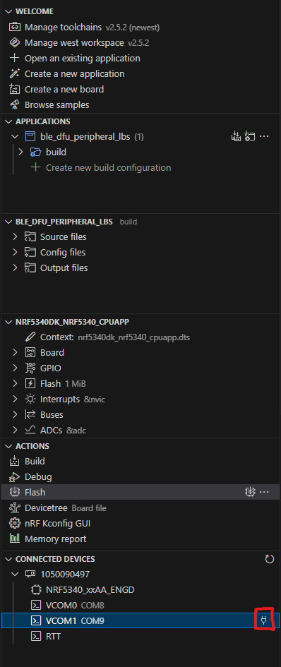
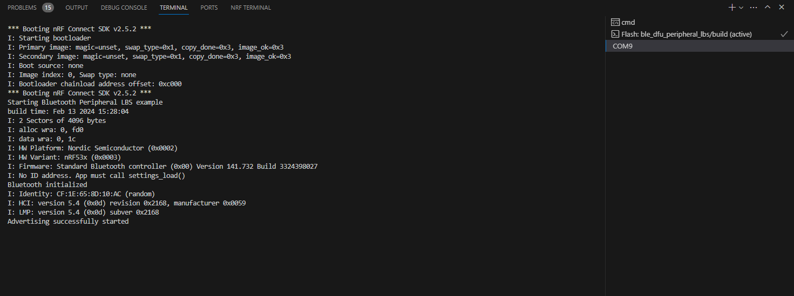
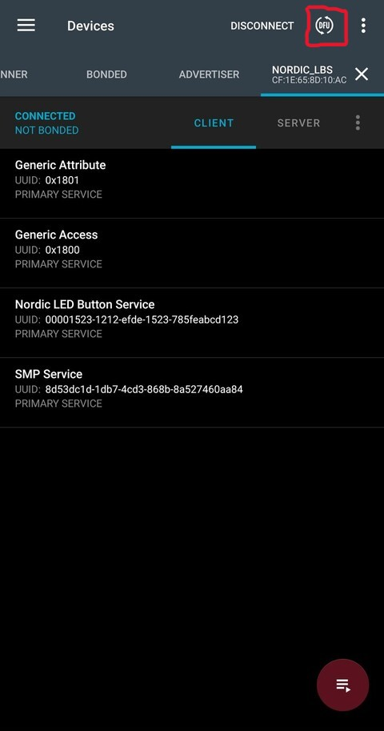
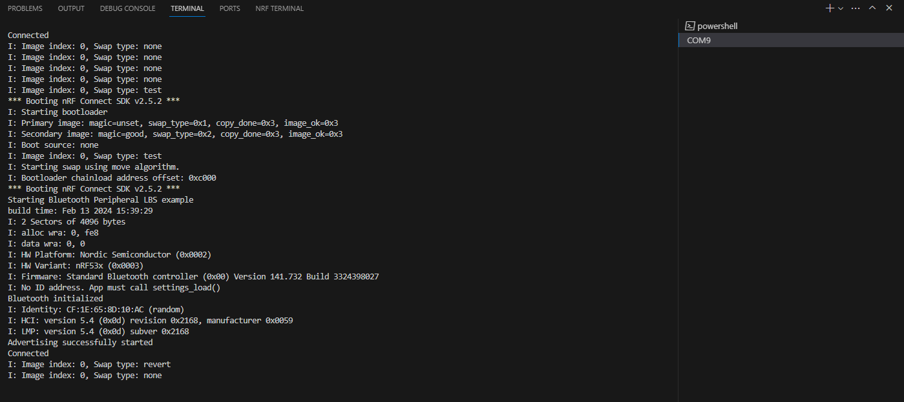

# Tutorial DFU over Bluetooth with custom Keys

___

## 0) Requirements

You must have a working DFU in the first place.
If not, see the 1_first_dfu tutorial.

___

## 1) Key generation

There are multiple ways to generate keys for the MCUboot ([here](https://developer.nordicsemi.com/nRF_Connect_SDK/doc/latest/nrf/config_and_build/bootloaders/bootloader_signature_keys.html))
But for the simplicity of the tutorial
We will keep things simple with only ecdsa-p256 key type.

First create a folder where you store your keys.
Ex: `C:\Users\trovallet\Documents\Stage\zephyr_first\keys\v1`
Named v1 because there might be other keys/type of keys

<details>
<summary><b>1) Private key in .pem</b></summary>

Has been tested and works well

```bash
nrfutil keys generate priv.pem
```

[Source](https://devzone.nordicsemi.com/guides/short-range-guides/b/software-development-kit/posts/nrf5-sdk-v17-1-0-secure-dfu-hands-on-tutorial)

</details>

<details>
<summary><b>2) Private key in .key</b></summary>

Has not been tested yet

</details>

___

## 2) Open Application

For the whole tutorial, we will keep the same app as the first DFU.

Now we need to open the app.
Select one of the 2 buttons



then select it in your windows browser



___

## 3) Modify the project

Go to the nRF Connect SDK path, then to `bootloader\mcuboot\boot\zephyr\prj.conf`
In my case, it's `C:\ncs\v2.5.2\bootloader\mcuboot\boot\zephyr\prj.conf`
Then you have multiple choices

<details>
<summary><b>1) Keep the keys in their folder / In app folder</b></summary>

In that case, add these lines:

``` conf
# Path to custom keys
CONFIG_BOOT_SIGNATURE_KEY_FILE="<absolute>/<path>/<to>/<key>/priv.pem"
# Fix to: undefined reference to 'rsa_pub_key_len'
CONFIG_BOOT_SIGNATURE_TYPE_ECDSA_P256=y
```

In my case:

- the path to their folder is : `C:/Users/trovallet/Documents/Stage/zephyr_first/keys/v2/priv.pem`
- the path to the app folder is: `C:/ncs/myapps/ble_dfu_peripheral_lbs/priv.pem`

</details>

<details>
<summary><b>2) Place the keys in the mcuboot folder</b></summary>

In that case, place the private key in the mcuboot folder `C:/ncs/v2.5.2/bootloader/mcuboot/`

Then add these lines:

``` conf
# Path to custom keys
CONFIG_BOOT_SIGNATURE_KEY_FILE="priv.pem"
# Fix to: undefined reference to 'rsa_pub_key_len'
CONFIG_BOOT_SIGNATURE_TYPE_ECDSA_P256=y
```

The path can be shorten

</details>

___

## 4) Build configuration

Now we need to configure the build settings.
Select one of the 2 button


<details>
<summary><b>You have a nRF5340 based product(Development Kit)</b></summary>

Select those 2 options to have a working build.

At the time of making the tuto, a danger sign appears when selecting the board.
It's because of the secure and non-secure way to build the application.
If you have it too, look it up later


</details>

<details>
<summary><b>You have a nRF52840 based product(Thingy:91)</b></summary>

Not written yet
</details>

This takes quite some time to generate.
But after the generation you should have something like that.


___

## 5) Flash the application

<details>
<summary><b>You have a Development Kit</b></summary>
Now is a good time to plug your device.
If ready, flash your application as presented below.


</details>

<details>
<summary><b>You have a Thingy</b></summary>
Not written yet
</details>

___

## 6) Observe booting

To see the return of our application, follow the steps:



For the next step the picture might not indicate what's to your screen.
Just go through the steps so you have the same configuration in the end.

  

  

Now press the `Reset Button` on the devkit.
And observe the boot sequence on the terminal.



What's to note is the build time of the application

___

## 7) Perform DFU

### A) New build + Send file to phone

<details>
<summary><b>Build + transfer</b></summary>

First you need to rebuild your application, by pressing the following button


Now you should transfer the updated file to your phone.
It is located at `<path_to_app_foolder>\build\zephyr\app_update.bin`
I have chosen bluetooth.


</details>

### B) Connect + Send file to device

<details>
<summary><b>Phone part</b></summary>

Now you have to open nRF Connect application on your phone.

Then connect to the the device


Then select `CONNECT` again in the top of the application.
You should now see the same things as the picture below.
Presss `DFU`



You are now headed to your file system, choose the app_update file.
Then select `Test and Confirm` and `OK`


You should see the graph like the picture below.


</details>

Once it is done, we can head back to the terminal.

<details>
<summary><b>Serial Result</b></summary>



Where we can see the build time is different than the previous one

</details>

___

## 8) Annexes

<details>
<summary><b>Serial Log after flash</b></summary>

```bash
*** Booting nRF Connect SDK v2.5.2 ***
I: Starting bootloader
I: Primary image: magic=unset, swap_type=0x1, copy_done=0x3, image_ok=0x3
I: Secondary image: magic=unset, swap_type=0x1, copy_done=0x3, image_ok=0x3
I: Boot source: none
I: Image index: 0, Swap type: none
I: Bootloader chainload address offset: 0xc000
*** Booting nRF Connect SDK v2.5.2 ***
Starting Bluetooth Peripheral LBS example
build time: Feb 15 2024 16:14:11
I: 2 Sectors of 4096 bytes
I: alloc wra: 0, fd0
I: data wra: 0, 1c
I: HW Platform: Nordic Semiconductor (0x0002)
I: HW Variant: nRF53x (0x0003)
I: Firmware: Standard Bluetooth controller (0x00) Version 141.732 Build 3324398027
I: No ID address. App must call settings_load()
Bluetooth initialized
I: Identity: CF:1E:65:8D:10:AC (random)
I: HCI: version 5.4 (0x0d) revision 0x2168, manufacturer 0x0059
I: LMP: version 5.4 (0x0d) subver 0x2168
Advertising successfully started
Connected
```

</details>

<details>
<summary><b>Serial Log in case of working DFU</b></summary>

```bash
I: Image index: 0, Swap type: none
I: Image index: 0, Swap type: none
I: Image index: 0, Swap type: none
I: Image index: 0, Swap type: none
I: Image index: 0, Swap type: test
*** Booting nRF Connect SDK v2.5.2 ***
I: Starting bootloader
I: Primary image: magic=unset, swap_type=0x1, copy_done=0x3, image_ok=0x3
I: Secondary image: magic=good, swap_type=0x2, copy_done=0x3, image_ok=0x3
I: Boot source: none
I: Image index: 0, Swap type: test
I: Starting swap using move algorithm.
I: Bootloader chainload address offset: 0xc000
*** Booting nRF Connect SDK v2.5.2 ***
Starting Bluetooth Peripheral LBS example
build time: Feb 15 2024 16:18:06
I: 2 Sectors of 4096 bytes
I: alloc wra: 0, fe8
I: data wra: 0, 0
I: HW Platform: Nordic Semiconductor (0x0002)
I: HW Variant: nRF53x (0x0003)
I: Firmware: Standard Bluetooth controller (0x00) Version 141.732 Build 3324398027
I: No ID address. App must call settings_load()
Bluetooth initialized
I: Identity: CF:1E:65:8D:10:AC (random)
I: HCI: version 5.4 (0x0d) revision 0x2168, manufacturer 0x0059
I: LMP: version 5.4 (0x0d) subver 0x2168
Advertising successfully started
Connected
```

</details>

<details>
<summary><b>Serial Log in case of failed DFU</b></summary>

```bash
I: Image index: 0, Swap type: revert
I: Image index: 0, Swap type: none
I: Image index: 0, Swap type: none
I: Image index: 0, Swap type: none
I: Image index: 0, Swap type: none
I: Image index: 0, Swap type: none
I: Image index: 0, Swap type: test
*** Booting nRF Connect SDK v2.5.2 ***
I: Starting bootloader
I: Primary image: magic=good, swap_type=0x2, copy_done=0x1, image_ok=0x1
I: Secondary image: magic=good, swap_type=0x2, copy_done=0x3, image_ok=0x3
I: Boot source: none
I: Image index: 0, Swap type: test
E: Image in the secondary slot is not valid!
I: Bootloader chainload address offset: 0xc000
*** Booting nRF Connect SDK v2.5.2 ***
Starting Bluetooth Peripheral LBS example
build time: Feb 15 2024 16:18:06
I: 2 Sectors of 4096 bytes
I: alloc wra: 0, fe8
I: data wra: 0, 0
I: HW Platform: Nordic Semiconductor (0x0002)
I: HW Variant: nRF53x (0x0003)
I: Firmware: Standard Bluetooth controller (0x00) Version 141.732 Build 3324398027
I: No ID address. App must call settings_load()
Bluetooth initialized
I: Identity: CF:1E:65:8D:10:AC (random)
I: HCI: version 5.4 (0x0d) revision 0x2168, manufacturer 0x0059
I: LMP: version 5.4 (0x0d) subver 0x2168
Advertising successfully started
Connected
```

</details>

___

## 9) Possible errors

### A) No `app_update.bin` in the `build/zephyr` folder

If the console doesn't provide any error but you can't find the `app_update.bin`.
Just delete the `build` folder in your application.
You will need to recreate a new build configuration (select the same options).
And the file should be here
