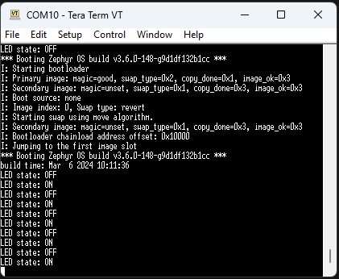
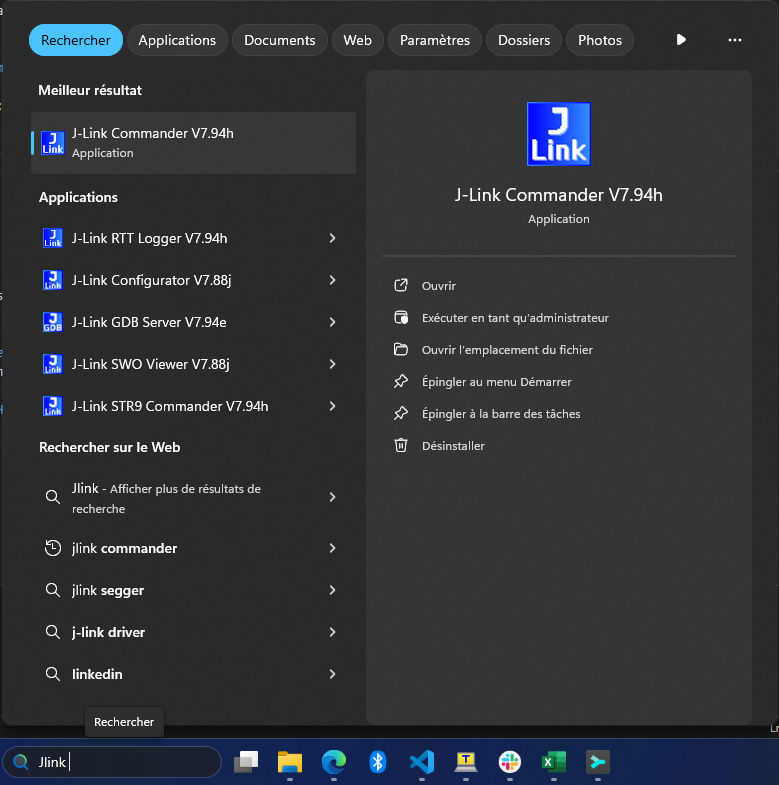

# Tutorial DFU over UART with Blinky sample on a Thingy91

Things omitted for the sake of simplicity:

- west programming
- Vanilla Zephyr (no board for thingy91, at the time of writing code)
- Custom keys (another Markdown is in the works)
- Thingy91 development (could not make it work with Vanilla Zephyr)
- Only made for Windows users

Before starting this tutorial, it is recommended to read the following links:

- [Zephyr's doc on MCUboot](https://docs.mcuboot.com/readme-zephyr.html)
- [Nordic's doc on MCUmgr](https://developer.nordicsemi.com/nRF_Connect_SDK/doc/latest/zephyr/services/device_mgmt/mcumgr.html)

___

## 0) Requirements

- nRF Connect for Desktop + a NCS toolchain installed + NCS for VSCode [nRF Connect SDK Install](https://developer.nordicsemi.com/nRF_Connect_SDK/doc/latest/nrf/installation.html)
- Go + MCUmgr ( [Go Install](https://go.dev/doc/install) + [MCUmgr from Zephyr](https://docs.zephyrproject.org/latest/services/device_mgmt/mcumgr.html))
- Serial Communication Port Reader (ex : TeraTerm / Putty / Termite)

___

## 1) Create application

### A) Copy sample

Go to your toolchain install. (ex: `c:\ncs\v2.5.2`)
Go to this path : `v2.5.2\zephyr\samples\basic`
Copy the `blinky` folder
Paste it in your app folder (ex: `ncs\apps\blinky`)
For the next steps, we will assume you pick the example folder

This will be the application we are working with.

### B) Modify sample

To make the DFU work, we will need to modify the `prj.conf` file

```bash
# Print a banner on the UART on startup.
CONFIG_BOOT_BANNER=y
CONFIG_BOOTLOADER_MCUBOOT=y
CONFIG_MCUBOOT_SIGNATURE_KEY_FILE="bootloader/mcuboot/root-rsa-2048.pem"

# Enable flash operations
CONFIG_FLASH=y

# Enable MCUmgr and dependencies
CONFIG_MCUMGR=y
CONFIG_NET_BUF=y
CONFIG_ZCBOR=y
CONFIG_CRC=y
CONFIG_STREAM_FLASH=y
CONFIG_FLASH_MAP=y

# Enable most core commands
CONFIG_IMG_MANAGER=y
CONFIG_MCUMGR_GRP_IMG=y
CONFIG_MCUMGR_GRP_OS=y

# Enable the serial mcumgr transport
CONFIG_MCUMGR_TRANSPORT_UART=y
CONFIG_BASE64=y
CONFIG_CONSOLE=y
```

And to see the effect of the DFU, we will need to modify the `src\main.c` file

```c
printk("build time: " __DATE__ " " __TIME__ "\n");
```

___

## 2) Build app

Create the build configuration (precise '_ns')

Launch the build

___

## 3) Flash app

Now is a good time to plug your device

With the Thingy91, you need to press the Main Button while turning it ON.
This triggers the Serial Recovery mode and make the Thingy programmable.

At this point you should open a Serial Communication Port Reader to see the incoming output.
Note that, at this point, you shouldn't see anything related to this application.

<details>
<summary><b>Use nRF Programmer</b></summary>

The nRF Programmer is available in the nRF Connect for Desktop app.

Install it and open it.

Select your device.

Select the file to program.

Press `Write.`

</details>
</br>
<details>
<summary><b>Use nRF Util</b></summary>

You can download this tool [here](https://www.nordicsemi.com/Products/Development-tools/nRF-Util)
Install the tool
Open a CMD and test the install with the following command
Then install `device`

```bash
nrfutil install device
```

Once it is done you can open a CMD in the build folder (ex:`apps\blinky\build\thingy91_9160_ns`)
Then enter this command

```bash
nrfutil device program --firmware app_signed.hex
```

</details>
</br>

So at this point you should have:

- the LED blinking
- the Serial Communication show information about the booting steps:
  - the bootloader log
  - the application log

You should note the build time in the Serial Communication port
It's visible at the start of the application log


___

## 4) Build app again

At this point, you have a working bootloader and application
Now we will update the application with a new version of the same application

But you can also use another application
Just make sure to have (at least) the same configuration as presented in step 1

For this part, we will just rebuild (it's enough to see the difference)
But if you want a more visual approach, there are possibilities available below

<details>
<summary><b>Rebuild the same app</b></summary>

</br>
<details>
<summary><b>[OPTIONAL] Modify the app</b></summary>

You can modify the app to bring a more visually updated approach
Here are some examples :

- the LED (led0 -> led1)
- the blinking rate (1000 -> 100)

</details>
</br>

Make a Pristine Build with the NCS for VSCode app

</details>
</br>
<details>
<summary><b>[OPTIONAL] New app</b></summary>

Follow the **A) Copy sample** in the **1) Create application**
Instead get the `v2.5.2\zephyr\samples\hello_world`
and copy it to `ncs\apps\hello_world`

Follow the same modification in the **B) Modify sample**
and add this library in the `ncs\apps\hello_world\src\main.c`

```c
#include <zephyr/kernel.h>
```

Make a Pristine Build with the NCS for VSCode app

</details>

___

## 5) Perform DFU

At this point, we use MCUmgr to perform the DFU.
Just know that other tools exists
[List of Over The Air Update provided by Zephyr](https://github.com/zephyrproject-rtos/zephyr/blob/main/doc/services/device_mgmt/ota.rst)

### A) Only For First Time

Open another terminal wherever you want
In the following, it will be called the **CONFIG_TERMINAL**

<details>
<summary><b>MCUmgr Install Verification</b></summary>

MCUmgr will use the Serial Communication Port

- Close your Serial Communication Port
- Go to your build folder (example : `ncs\apps\blinky\build\thingy91_9160_ns`)
  - then `zephyr` folder
  - then verify the presence of `app_update.bin`

In the **CONFIG_TERMINAL**

```bash
mcumgr version
```

and you should get

```bash
mcumgr 0.0.0-dev
```

This verifies your installation of MCUmgr

</details>
</br>
<details>
<summary><b>First config</b></summary>

In the **CONFIG_TERMINAL**

```bash
nrfutil device list
```

and the result should be something like this:

```bash
1050090497    COM11    VCOM0
1050090497    COM10    VCOM1
```

It is normal if you only have one (it will be easier)
This allow us to get the connected serial communication port that are available
Replace the `<name>` and the `COMXX` before copy the next command in the **CONFIG_TERMINAL**

```bash
mcumgr conn add <name> type=serial connstring=COMXX
```

Now to test if you have correctly setup your serial connection
Close any Serial Communication Port that could be open
Copy this command to the **CONFIG_TERMINAL**

```bash
mcumgr -c <name> echo hello
```

You should receive `hello` almost instantly, if not see possible errors
If you do not have any error, you can try the next one

```bash
mcumgr -c <name> image list
```

You should have a list of details on the current image on the slot

</details>

</br>

At this point you can close **CONFIG_TERMINAL**

### B) Application transfer

Open another terminal in your build folder (ex: `ncs\apps\blinky\build\thingy91_9160_ns`)
If you built **[OPTIONAL] New app**, you must go to the new application build folder
In the following, it will be called the **COMM_TERMINAL**

Adapt and copy this command:

```bash
mcumgr -c <name> image upload -e zephyr/app_update.bin
```

Now you should be printed with a loading bar.
In this project, the loading should take around 15-20 seconds
Once the upload done, we check the presence of the image

Enter this command in the **COMM_TERMINAL**

```bash
mcumgr -c <name> image list
```

You should see 2 images in 2 slots (slot0 and slot1)
At this point 2 images are on the nordic
But the original one will always be selected upon each reset
Let's modify this


Copy the hash of the second image
Then adapt and enter this command in the **COMM_TERMINAL**

```bash
mcumgr -c <name> image test <hash>
```

Now open a Serial COM port (ex: TeraTerm)

And press the `RESET` on your board
You should see the Bootloader swpping the image to another
And in the end the application load with a more up to date Build Time


Press the `RESET` button again on your board
Now the application loading is the original



Close the Serial COM port

Enter this command

```bash
mcumgr -c <name> image confirm <hash>
```

Now open a Serial COM port

After pressing the `RESET` button
And now you can see the new application booting again
Only this time, when you press the `RESET` button again
It still boots on the most up to date image

You have now performed your first DFU !!

You can play with the 2 pictures that are on the nordic
You have to copy the hahs of the original image
And follow the same step as above.

If you don't want to press the `RESET` button anymore
You can force the reset with this command

```bash
mcumgr -c <name> reset
```

And even optimizing the whole process with one command

```bash
mcumgr -c <name> image confirm <hash> && mcumgr -c <name> reset
```

___

## 9) Possible errors

### A) No `app_update.bin` in the `build/zephyr` folder

If the console doesn't provide any error but you can't find the `app_update.bin`.
Just delete the `build` folder in your application.
You will need to recreate a new build configuration (select the same options).
And the file should be here

### B) When `mcumgr` command => `Acces is denied`

In most cases, you forgot to close the Serial Communication Port

### C) When `mcumgr` command => `NMP timeout`

Try to execute simpler command like

```bash
mcumgr -c <name> echo hello
```

If it happened try the failed command a second time, it could work now.
If it doesn't work, this is generally because the MCUmgr config in the `prj.conf` is badly set.

### D) When `mcumgr image update` command => Stuck at 0%

Try deactivate mass storage on device:

- Open Jlink Commander

- Execute this command:

```bash
MSDDisable
```

Then retry to perform update.
If still stuck, do the following steps in the right order:

- Flash the application
- ***At this point the device is locked, we need to recover it***
- Flash the application
  - An error should be prompted
  - Enter the same command + add `--recover` at the end
- Flash the NCS bootloader
- Return to **How to verify** then **How to perform DFU**
