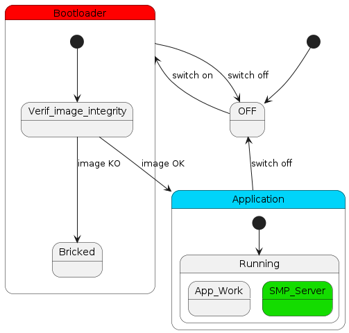
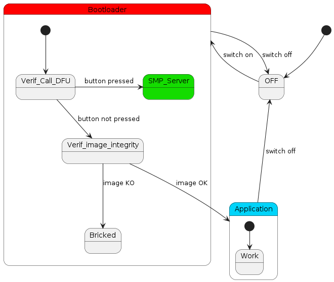

# README

Before diving in here, I recommand trying multiple type of classic DFU (if available)

## 2 types of SMP Server

You can configure 2 types of SMP Server.

The presented version in the Main tutorials.

In this representation you can see 3 main states:

- OFF
- Bootloader
- Application

When turning on the device, it launch the bootloader.
The bootloader will then perform an integrity check (and multiple other checks not shown to keep it simple)
If the tests pass, the application is authorized to load.
Once the application is loaded, the DFU_State is accessible all the time, as it runs at the same time as the application

What is key to understand is that the DFU State is running at the same time as the application.
And the update is performed when it resets.

In this other representation you can see 3 same states.

In that case, the "DFU State" is called **`SERIAL RECOVERY`**
More documentation [here](https://docs.mcuboot.com/serial_recovery.html)

It is a different placement in the booting sequence and a different naming, but it mainly does the same thing.

The main difference is that Serial Recovery is accessible before the application is launched.
It needs an interaction with the target to activate the State.
This is generally done via the push of another button at the startup of the target.

After the update is done, it needs to restart the target to launch the new application.

## Pros

The main advantage is that the device is never in DFU_State when it is in normal usage.

The second main advantage is that the size of the application remains the same, giving more room for additional features

## Cons

The main disadvantage is that it's limited to UART and USB-CDC.

Couldn't make it work with 2 image slots (managed to upload but couldn't confirm)
