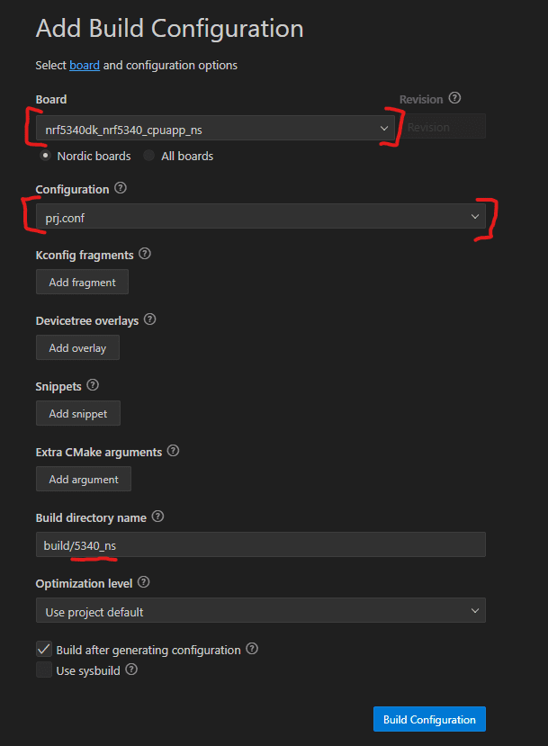

# Tutorial DFU over USB-CDC with Blinky sample with the Serial Recovery Mode

This tutorial will show:

- How to perform a DFU over USB-CDC
- How to use MCUmgr
- With the Blinky sample
- **With the Serial Recovery Mode**

Things omitted for the sake of simplicity:

- Building the app as Secure Processing Environment (if working as Non-Secure Processing Environment (TF-M), Secure Processing Environment should be forgotten)
- Custom keys (another tutorial is available)
- Thingy91 as a target (is not compatible with this tutorial)
- Other OS than Windows

Before starting this tutorial, it is recommended to read the following links:

- [Zephyr's doc on MCUboot](https://docs.mcuboot.com/readme-zephyr.html)
- [Nordic's doc on MCUmgr](https://developer.nordicsemi.com/nRF_Connect_SDK/doc/latest/zephyr/services/device_mgmt/mcumgr.html)

This tutorial is made for NCS install.

It is not compatible with the zephyrproject install.

If you are interested by the zephyrproject / Vanilla Zephyr version.  
It is not available yet.

___

## 0) Requirements

This tutorial is made for NCS install.
You must have a NCS install that is already working.

With the global requirements, you should add the following:

- a second USB cable
- Go + MCUmgr ([Go Install](https://go.dev/doc/install) + [MCUmgr from Zephyr](https://docs.zephyrproject.org/latest/services/device_mgmt/mcumgr.html))

___

## 1) Create Application

In nRF Connect for VS Code, create a new application.
Select one of the 2 button


You should have this window that pops up.  
We will create an app from an existing sample.  
Select the corresponding button


Then select the Blinky sample by searching `blinky`


Then save the app.
You should pick a high level folder because of the limit of 250 characters by CMake  
Furthermore, when you build the application you will have a `build` folder and within
a lots of folder and folder thus making the full path of certain files very long.

I choose this path for the example : `c:\ncs\apps\dfu_tutorial`
And I gave it the name `dfu_usb-cdc_boot`


This will be the application we are working with.

___

## 2) Modify Application

At this point you should have something like this:

```bash
.
└── dfu_tutorial/
    └── dfu_usb-cdc_boot/
        ├── src/
        │   └── main.c
        ├── .gitignore
        ├── CMakeLists.txt
        ├── prj.conf
        ├── README.rst
        └── sample.yaml
```

To make the DFU work, we will need to modify the application

### A) src/main.c

In your app folder, open `src/main.c`

Add this line of code in the main() => around line 25

```c
printk("build time: " __DATE__ " " __TIME__ "\n");
```

This will allow us to see the difference between old and new code after the update.
You should have something like this:


Don't forget to save `src/main.c`!!

### B) prj.conf

Now open `prj.conf` and copy-paste the next lines.

```bash
# Enable MCUboot
CONFIG_BOOTLOADER_MCUBOOT=y
```

You should have something like this:


Don't forget to save `prj.conf`!!

### C) child_image/mcuboot.conf

You need to configure the log of MCUboot to see how it is done

In your app folder, create a folder named `child_image`
In this folder create a file named `mcuboot.conf`
And add these lines inside the file

```bash
# Enable Serial Recovery
CONFIG_MCUBOOT_SERIAL=y
CONFIG_BOOT_SERIAL_UART=y

# Configure Serial Recovery to use CDC_ACM, which by default uses the USB
CONFIG_BOOT_SERIAL_CDC_ACM=y

# Increase flash space for MCUboot child image, to fit USB drivers
# Size depends on your target : 0x15000 is for nrf5340dk 
CONFIG_PM_PARTITION_SIZE_MCUBOOT=0x15000

# Deactivate console on UART, since Serial Recovery uses it
CONFIG_UART_CONSOLE=n

# Turn on a LED when Serial Recovery mode is active
CONFIG_MCUBOOT_INDICATION_LED=y

# Configure Bootlader to only use one slot.
CONFIG_SINGLE_APPLICATION_SLOT=y
```

This will allow us to have the details in the MCUboot part.
It will also allow the bootloader to have access to the USB stack.

Allowing the access means the bootloader's size is increased.
The partition size for the bootloader needs to be increased.
The value depends on your target [More details here (Step 3)](https://academy.nordicsemi.com/courses/nrf-connect-sdk-intermediate/lessons/lesson-8-bootloaders-and-dfu-fota/topic/exercise-2-dfu-over-usb-adding-external-flash/)
As I have a nrf5340dk, I will set the value to `0x15000`.

Don't forget to save `child_image/mcuboot.conf`!!

### D) child_image/mcuboot.overlay

Create a file named `mcuboot.overlay` at the project root
And add this code inside the file

```bash
/ {
    aliases {
          mcuboot-button0 = &button1;
          mcuboot-led0 = &led1;
    };
  };
```

This will allow the bootloader to enter the DFU mode (button).
And also signals that it is in DFU mode.

Don't forget to save `child_image/mcuboot.conf`!!

### E) pm_static.yml

Create a file named `pm_static.yml` at the project root
And add this code inside the file

```yaml
mcuboot_sram:
  address: 0x20000000
  end_address: 0x2000a000
  size: 0xa000
```

If you do not include this file, the build will fail and say that not everything in RAM section.
This file increase the ram dedicated to mcuboot to finish the build.

Don't forget to save `pm_static.yml`!!

At this point you should have something like this:

```bash
.
└── dfu_tutorial/
    └── dfu_usb-cdc_boot/
        ├── child_image/
        │   ├── mcuboot.conf (U)
        │   └── mcuboot.overlay (U)
        ├── src/
        │   └── main.c (M)
        ├── .gitignore
        ├── CMakeLists.txt
        ├── prj.conf (M)
        ├── pm_static.yml (U)
        ├── README.rst
        └── sample.yml
```

___

## 3) Build Application

Now we need to configure the build settings.
Select one of the 2 button


Select those 2 options and rename the output build folder to something recognizable.



If the build fails, try rebuild first (sometimes NCS needs a second build)
If it still fails, [check this](https://github.com/romaintrovallet/tutorials/blob/master/Errors_encountered/Build.md)

This takes quite some time to generate.
But after the generation you should have something like that.


___

## 4) Flash Application

Now is a good time to plug your device.
For now, **ONLY ONE** USB cable will be used.

Once it is plugged and turned ON, you have 2 choices:

<details>
<summary><b>Open VSCode Serial Communication Port Reader</b></summary>

To see the log of our application, follow the steps:


For the next step the picture might not indicate what's to your screen.
Just go through the steps so you have the same configuration in the end.


</details>
</br>
<details>
<summary><b>Open your Serial Communication Port Reader</b></summary>

You have to find the used COM port (TeraTerm select it automatically)
And set the baud rate to `115200`

Once these 2 things are set, you are ready to flash

</details>
</br>

If ready, select the `Flash & Erase` command as presented below


If the flash was successful, you should see 2 things:

- A LED is blinking at a 1 sec rate
- The Serial log wich is just the application log

The Serial log should be something like this


If you missed it, you can still press the `RESET` button
You should note the build time in the Serial Communication log
It's visible at the start of the application log

___

## 5) Build Application again

At this point, you have a working bootloader and application
Now we will update the application with a new version of the same application

But you can also use another application
Just make sure to have (at least) the same configuration as presented in step 1

For this part, we will just rebuild (it's enough to see the difference)
But if you want a more visual approach, there are possibilities available below

<details>
<summary><b>Rebuild the same app</b></summary>
</br>
<details>
<summary><b>[OPTIONAL] Modify the app</b></summary>

You can modify the app to bring a more visually updated approach
Here are some examples :

- the blinking LED (led0 -> led1) (line 14 in `src/main.c`)
- the blinking rate (1000 -> 100) (line 11 in `src/main.c`)
- the name of the USB device (add following lines in `prj.conf`)

```bash
# See effect of DFU
CONFIG_USB_DEVICE_PRODUCT="Zephyr DFU sample"
```

</details>
</br>

Rebuild by following the instructions below


</details>
</br>
<details>
<summary><b>[OPTIONAL] New app</b></summary>

Follow the **1) Create Application**
Instead get the `hello_world` sample
and save it to someplace findable: `apps/dfu_tutorial/hello_world`
then rename it to something recognizable: `apps/dfu_tutorial/dfu_usb-cdc_boot_hw`

Follow the same modification in the **2) Modify Application**
and add this library in the `apps/dfu_tutorial/dfu_usb-cdc_boot_hw/src/main.c`

```c
#include <zephyr/kernel.h>
```

Once done create the same Build Configuration as in **3) Build Application**

</details>

___

## 6) Perform DFU

At this point, we use MCUmgr to perform the DFU over USB-CDC.
Just know that other tools exists
[List of Tools & Libraries to Perform Update](https://docs.zephyrproject.org/latest/services/device_mgmt/mcumgr.html#tools-libraries)

We have to enter the DFU state, as described in this diagram below


So before doing anything, connect the second cable to the devkit.

You also need to press the DFU button (button 1 in the devicetree == button 2 on the DK)
And press the reset button while you hold the DFU button.
If the manipulation was successful, you should see no log in the Terminal and the LED is ON.


### A) Only for First Time with MCUmgr with USB-CDC

Open another terminal wherever you want
In the following, it will be called the **CONFIG_TERMINAL**

<details>
<summary><b>MCUmgr Install Verification</b></summary>

MCUmgr will use the Serial Communication Port

- Go to your build folder (example : `apps/dfu_tutorial/dfu_usb-cdc_boot/build/5340_ns`)
  - then `zephyr` folder
  - then verify the presence of `app_update.bin`

In the **CONFIG_TERMINAL**

```bash
mcumgr version
```

and you should get

```bash
mcumgr 0.0.0-dev
```

This verifies your installation of MCUmgr

</details>
</br>
<details>
<summary><b>First MCUmgr USB-CDC config</b></summary>

In the **CONFIG_TERMINAL**

```bash
nrfutil device list
```

and the result should be something like this:

```bash

105009XXXX
product         J-Link
board version   PCA100XX
ports           COM11, vcom: 0
                COM10, vcom: 1
traits          devkit, jlink, seggerUsb, serialPorts, usb

DCAD2FBA45EFXXXX
product         USB-DEV
ports           COM15
traits          serialPorts, usb

Found 2 supported device(s)

```

If you have only 1 device detected:  
Verify that you have 2 cables connected between you PC and the devkit.

This allow us to get the serial communication port that are available.
The one that interest us is the one linked to `USB-DEV` product, in my case `COM15`.

Now let's create a configuration for this communication port.
Replace the `<name>` and the `COMXX` before copy the next command in the **CONFIG_TERMINAL**.

```bash
mcumgr conn add <name> type=serial connstring=COMXX
```

In my case:

- `<name>` will be `com15`, but you can name it as you wish.
- `COMXX` will be `COM15`, but you must select the communication port corresponding

Now to test if you have correctly setup your serial connection
Copy this command to the **CONFIG_TERMINAL**

```bash
mcumgr -c <name> echo hello
```

You should receive `hello` almost instantly, if not see possible errors
If you do not have any error, you can try the next one

```bash
mcumgr -c <name> image list
```

You should have a list of details on the current image on the slot

</details>
</br>

At this point you can close **CONFIG_TERMINAL**

### B) Application transfer

Go to your build folder (ex: `apps/dfu_tutorial/dfu_usb-cdc_boot/build/5340_ns`)  
If you built **[OPTIONAL] New app** (in the **5) Build Application again**)
You must go to the new application build folder

Check for the presence of `zephyr/app_update.bin`

Open a new Terminal in the build folder
In the following, it will be called the **COMM_TERMINAL**

Adapt and copy this command:

```bash
mcumgr -c <name> image list
```

(If you don't know what 'name' is, go back to **First MCUmgr USB-CDC Config**)  
You should have the list of images that are on target


Adapt and copy this command:

```bash
mcumgr -c <name> image upload -e zephyr/app_update.bin
```

Now you should be printed with a loading bar.
In this project, the loading should take around 15-20 seconds.


Once the upload done, we check the presence of the image

Enter this command in the **COMM_TERMINAL**

```bash
mcumgr -c <name> image list
```

You should see a different hash for the new image.
If you recall correctly, at this point we had 2 images with other tutorials.
We can do this modification because no application is running, allowing it to directly replace the old one.
It seems to be possible to implement the second slot, but I did not had any success...


Now let's read the Serial COM port.

The application loads with a more up to date Build Time


You have now performed a DFU over USB-CDC with Serial Recovery !!
