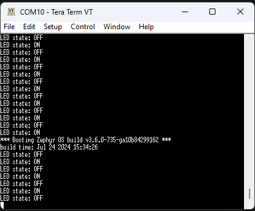

# Tutorial DFU over USB-CDC with Blinky sample with the Serial Recovery Mode

This tutorial will show:

- How to perform a DFU over USB-CDC
- How to use MCUmgr
- With the Blinky sample
- **With the Serial Recovery Mode**

Things omitted for the sake of simplicity:

- Use of NCS for VSCode app
- Building the app as Secure Processing Environment (if working as Non-Secure Processing Environment (TF-M), Secure Processing Environment should be forgotten)
- Custom keys (another tutorial is available)
- Thingy91 as a target (could not make it work with Vanilla Zephyr)
- Other OS than Windows

Before starting this tutorial, it is recommended to read the following links:

- [Zephyr's doc on MCUboot](https://docs.mcuboot.com/readme-zephyr.html)
- [Nordic's doc on MCUmgr](https://developer.nordicsemi.com/nRF_Connect_SDK/doc/latest/zephyr/services/device_mgmt/mcumgr.html)

This tutorial is made for zephyrproject + zephyr SDK install

But it can be used with Zephyr version of NCS
**Not recommended if you have a zephyrproject install**
Just replace `zephyrproject` with your toolchain version (ex:`v2.6.0`)

If you are interested by the "official" NCS version.  
It can be found [here](https://github.com/romaintrovallet/tutorials/blob/master/DFU_in_Serial_Recovery/NCS_USB-CDC_SR.md)  

___

## 0) Requirements

This tutorial is made for zephyrproject + zephyr SDK install
You must have a zephyrproject install that is already working.

With the global requirements, you should add the following:

- a second USB cable
- Go + MCUmgr ([Go Install](https://go.dev/doc/install) + [MCUmgr from Zephyr](https://docs.zephyrproject.org/latest/services/device_mgmt/mcumgr.html))

___

## 1) Create Application

Go to your zephyrproject install.
Go to this path : `zephyrproject/zephyr/samples/basic`
Copy the `blinky` folder

Paste it in your app folder (ex: `zephyrproject/dfu_tutorial/blinky`)
Rename it to a more appropriate name (ex: `zephyrproject/dfu_tutorial/dfu_usb-cdc_sr`)
For the next steps, we will assume you pick the example folder

This will be the application we are working with.

___

## 2) Modify Application

At this point you should have something like this:

```bash
.
└── dfu_tutorial/
    └── dfu_usb-cdc_sr/
        ├── src/
        │   └── main.c
        ├── .gitignore
        ├── CMakeLists.txt
        ├── prj.conf
        ├── README.rst
        └── sample.yaml
```

To make the DFU work, we will need to modify the application

### A) src/main.c

In your app folder, open `src/main.c`

Add this line of code in the main() => around line 26

```c
printk("build time: " __DATE__ " " __TIME__ "\n");
```

This will allow us to see the difference between old and new code after the update.
You should have something like this:


Don't forget to save `src/main.c`!!

### B) prj.conf

Now open `prj.conf` and copy-paste the following lines.

```bash
# Enable MCUboot
CONFIG_BOOTLOADER_MCUBOOT=y

# Use the default MCUBoot PEM key file to sign binary
CONFIG_MCUBOOT_SIGNATURE_KEY_FILE="bootloader/mcuboot/root-rsa-2048.pem"
```

You should have something like this:


Don't forget to save `prj.conf`!!

### C) child_image/mcuboot.conf

You need to configure the log of MCUboot to see how it is done

In your app folder, create a folder named `child_image`
In this folder create a file named `mcuboot.conf`
And add these lines inside the file

```bash
# Enable Serial Recovery
CONFIG_MCUBOOT_SERIAL=y

# Force disable UART
CONFIG_BOOT_SERIAL_UART=n

# Configure Serial Recovery to use CDC_ACM, which by default uses the USB
CONFIG_BOOT_SERIAL_CDC_ACM=y

# Deactivate console on UART, since Serial Recovery uses it
CONFIG_UART_CONSOLE=n

# Turn on a LED when Serial Recovery mode is active
CONFIG_MCUBOOT_INDICATION_LED=y

# Configure Bootlader to only use one slot.
CONFIG_SINGLE_APPLICATION_SLOT=y
```

Don't forget to save `child_image/mcuboot.conf`!!

### D) child_image/mcuboot.overlay

Create a file named `mcuboot.overlay` at the project root
And add this code inside the file

```bash
/ {
    aliases {
          mcuboot-button0 = &button1;
          mcuboot-led0 = &led1;
    };
  };
  &zephyr_udc0 {
          cdc_acm_uart0 {
                  compatible = "zephyr,cdc-acm-uart";   
          };
  };
```

At this point you should have something like this:

```bash
.
└── dfu_tutorial/
    └── dfu_usb-cdc_sr/
        ├── child_image/
        │   ├── mcuboot.conf (U)
        │   └── mcuboot.overlay (U)
        ├── src/
        │   └── main.c (M)
        ├── .gitignore
        ├── CMakeLists.txt
        ├── prj.conf (M)
        ├── README.rst
        └── sample.yaml
```

___

## 3) Command Line config

In this tutorial we will use the command line
Open a terminal in the parent folder of `zephyrproject`

You will need to build applications and bootloaders until Step 7 included.
If, for whatever reason, you cannot complete the whole tutorial in one time.
You need to make this ***Step all over again.***

In the following, it will be called the **MAIN_TERMINAL**

Enter this command:

```bash
echo %ZEPHYR_BASE%
```

and it should return something like this:

```bash
<absolute>\<path>\<to>\zephyrproject\zephyr
```

If not go to error section

Still in the **MAIN_TERMINAL**, enter this command:

```bash
zephyrproject\.venv\Scripts\activate.bat
```

You are now in the zephyr virtual environment.
Keep your **MAIN_TERMINAL** open.

Enter the following commands:

```bash
cd zephyrproject
```

```bash
west update
```

```bash
west zephyr-export
```

Once done, keep it in your background and do not close it

___

## 4) Build Application

In the **MAIN_TERMINAL**

Enter this command :

```bash
west build -b nrf5340dk/nrf5340/cpuapp dfu_tutorial/dfu_usb-cdc_sr -d dfu_tutorial/dfu_usb-cdc_sr/build/5340_s
```

If the build fails, try rebuild first (sometimes Zephyr needs a second build)
If it still fails, go to possible error section

___

## 5) Build Bootloader

In the **MAIN_TERMINAL**

Enter this command :

```bash
west build -b nrf5340dk/nrf5340/cpuapp bootloader/mcuboot/boot/zephyr -d dfu_tutorial/dfu_usb-cdc_sr/build/5340_s/mcuboot -- -DEXTRA_DTC_OVERLAY_FILE=<absolute>/<path>/<to>/zephyrproject/dfu_tutorial/dfu_usb-cdc_sr/child_image/mcuboot.overlay -DEXTRA_CONF_FILE=<absolute>/<path>/<to>/zephyrproject/dfu_tutorial/dfu_usb-cdc_sr/child_image/mcuboot.conf
```

___

## 6) Flash Application

Now is a good time to plug your device.

Once it is plugged and turned ON, enter this command in the **MAIN_TERMINAL**:

```bash
west flash -d dfu_tutorial/dfu_usb-cdc_sr/build/5340_s --recover
```

If it doesn't flash, go to possible errors sections

At this point you should open a Serial Communication Port Reader to see the incoming output.

You have to find the used COM port (TeraTerm select it automatically).
And set the baud rate to `115200`.
Note that, at this point, you shouldn't see anything related to this application.

Once these 2 things are set, you are ready to flash the bootloader

___

## 7) Flash Bootloader

In the **MAIN_TERMINAL**

Enter this command :

```bash
west flash -d dfu_tutorial/dfu_usb-cdc_sr/build/5340_s/mcuboot
```

If the flash was successful, you should see 2 things:

- A LED is blinking at a 1 sec rate
- The Serial log wich is just the application log

The Serial log should be something like this


If you missed it, you can still press the `RESET` button
You should note the build time in the Serial Communication log
It's visible at the start of the application log

___

## 8) Build Application again

At this point, you have a working bootloader and application
Now we will update the application with a new version of the same application

But you can also use another application
Just make sure to have (at least) the same configuration as presented in step 1

For this part, we will just rebuild (it's enough to see the difference)
But if you want a more visual approach, there are possibilities available below

<details>
<summary><b>Rebuild the same app</b></summary>
</br>
<details>
<summary><b>[OPTIONAL] Modify the app</b></summary>

You can modify the app to bring a more visually updated approach
Here are some examples :

- the blinking LED (led0 -> led1) (line 15 in `src/main.c`)
- the blinking rate (1000 -> 100) (line 12 in `src/main.c`)
- the name of the USB device (add following lines in `prj.conf`)

```bash
# See effect of DFU
CONFIG_USB_DEVICE_PRODUCT="Zephyr DFU sample"
```

</details>
</br>

In the **MAIN_TERMINAL**

Enter this command :

```bash
west build -b nrf5340dk/nrf5340/cpuapp dfu_tutorial/dfu_usb-cdc_sr -d dfu_tutorial/dfu_usb-cdc_sr/build/5340_s -p
```

</details>
</br>
<details>
<summary><b>[OPTIONAL] New app</b></summary>

Follow the **A) Copy sample** in the **1) Create Application**
Instead get the `zephyrproject/zephyr/samples/hello_world`sample
and save it to someplace findable: `zephyrproject/dfu_tutorial/hello_world`
then rename it to `zephyrproject/dfu_tutorial/dfu_usb-cdc_sr_hw`

Follow the same modification in the **2) Modify Application**
and add this library in the `zephyrproject/dfu_tutorial/dfu_usb-cdc_sr_hw/src/main.c`

```c
#include <zephyr/kernel.h>
```

In the **MAIN_TERMINAL**

Then build it with this command

```bash
west build -b nrf5340dk/nrf5340/cpuapp dfu_tutorial/dfu_usb-cdc_sr_hw -d dfu_tutorial/dfu_usb-cdc_sr_hw/build/5340_s
```

</details>

___

## 9) Perform DFU

At this point, we use MCUmgr to perform the DFU over USB-CDC.
Just know that other tools exists
[List of Tools & Libraries to Perform Update](https://docs.zephyrproject.org/latest/services/device_mgmt/mcumgr.html#tools-libraries)

We have to enter the DFU state, as described in this diagram below


So before doing anything, connect the second cable to the devkit.

You also need to press the DFU button (button 1 in the devicetree == button 2 on the DK)
And press the reset button while you hold the DFU button.
If the manipulation was successful, you should see no log in the Terminal and the LED is ON.


### A) Only for First Time with MCUmgr with USB-CDC

Open another terminal wherever you want
In the following, it will be called the **CONFIG_TERMINAL**

<details>
<summary><b>MCUmgr Install Verification</b></summary>

MCUmgr will use the Serial Communication Port

- Go to your build folder (example : `zephyrproject/dfu_tutorial/dfu_usb-cdc_sr/build/5340_s`)
  - then `zephyr` folder
  - then verify the presence of `zephyr.signed.bin`

In the **CONFIG_TERMINAL**

```bash
mcumgr version
```

and you should get

```bash
mcumgr 0.0.0-dev
```

This verifies your installation of MCUmgr

</details>
</br>
<details>
<summary><b>First MCUmgr USB-CDC config</b></summary>

In the **CONFIG_TERMINAL**

```bash
nrfutil device list
```

and the result should be something like this:

```bash

105009XXXX
product         J-Link
board version   PCA100XX
ports           COM11, vcom: 0
                COM10, vcom: 1
traits          devkit, jlink, seggerUsb, serialPorts, usb

DCAD2FBA45EFXXXX
product         USB-DEV
ports           COM15
traits          serialPorts, usb

Found 2 supported device(s)

```

If you have only 1 device detected:  
Verify that you have 2 cables connected between you PC and the devkit.

This allow us to get the serial communication port that are available.
The one that interest us is the one linked to `USB-DEV` product, in my case `COM15`.

Now let's create a configuration for this communication port.
Replace the `<name>` and the `COMXX` before copy the next command in the **CONFIG_TERMINAL**.

```bash
mcumgr conn add <name> type=serial connstring=COMXX
```

In my case:

- `<name>` will be `com15`, but you can name it as you wish.
- `COMXX` will be `COM15`, but you must select the communication port corresponding

Now to test if you have correctly setup your serial connection
Copy this command to the **CONFIG_TERMINAL**

```bash
mcumgr -c <name> image list
```

You should have a list of details on the current image on the slot
If you do not have any error, you can go to the next step

</details>
</br>

At this point you can close **CONFIG_TERMINAL**

### B) Application transfer

Go to your build folder (ex: `zephyrproject/dfu_tutorial/dfu_usb-cdc_sr/build/5340_s`)  
If you built **[OPTIONAL] New app** (in the **8) Build Application again**)
You must go to the new application build folder

Check for the presence of `zephyr/zephyr.signed.bin`

Open a new Terminal in the build folder
In the following, it will be called the **COMM_TERMINAL**

Adapt and copy this command:

```bash
mcumgr -c <name> image list
```

(If you don't know what 'name' is, go back to **First MCUmgr USB-CDC config**)  
You should have the list of images that are on target


Adapt and copy this command:

```bash
mcumgr -c <name> image upload -e zephyr/zephyr.signed.bin
```

Now you should be printed with a loading bar.
In this project, the loading should take around 10 seconds.


Once the upload done, we check the presence of the image

Enter this command in the **COMM_TERMINAL**

```bash
mcumgr -c <name> image list
```

You should see a different hash for the new image.
If you recall correctly, at this point we had 2 images with other tutorials.
We can do this modification because no application is running, allowing it to directly replace the old one.
It seems to be possible to implement the second slot, but I did not had any success...


Let's see the result:

- Reopen the Serial COM port Reader
- Restart the board

The application loads with a more up to date Build Time



You have now performed a DFU over USB-CDC with Serial Recovery !!
