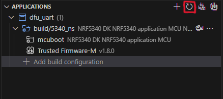

# Possible errors that could occur during Build

## A) No configure step for 'tfm'

Relaunch the pristine build, it should work (no idea why it fails on the first try)

## B) could not create temporary file whilst writing archive: no more archived files

<details>
<summary><b>Error Log</b></summary>

```bash
[165/169] Linking C executable bin\tfm_s.axf
Memory region         Used Size  Region Size  %age Used
           FLASH:       31592 B      32256 B     97.94%
             RAM:       10416 B        32 KB     31.79%
[23/297] Performing install step for 'tfm'
-- Install configuration: "MinSizeRel"
----- Installing platform NS -----
[148/297] Linking C static library modules\nrf\modules\trusted-firmware-m\lib..__nrf__modules__trusted-firmware-m.a
FAILED: modules/nrf/modules/trusted-firmware-m/lib..__nrf__modules__trusted-firmware-m.a 
cmd.exe /C "cd . && C:\ncs\toolchains\cf2149caf2\opt\bin\cmake.exe -E rm -f modules\nrf\modules\trusted-firmware-m\lib..__nrf__modules__trusted-firmware-m.a && C:\ncs\toolchains\cf2149caf2\opt\zephyr-sdk\arm-zephyr-eabi\bin\arm-zephyr-eabi-ar.exe qc modules\nrf\modules\trusted-firmware-m\lib..__nrf__modules__trusted-firmware-m.a  modules/nrf/modules/trusted-firmware-m/CMakeFiles/..__nrf__modules__trusted-firmware-m.dir/fault.c.obj && C:\ncs\toolchains\cf2149caf2\opt\zephyr-sdk\arm-zephyr-eabi\bin\arm-zephyr-eabi-ranlib.exe modules\nrf\modules\trusted-firmware-m\lib..__nrf__modules__trusted-firmware-m.a && cd ."
C:\ncs\toolchains\cf2149caf2\opt\zephyr-sdk\arm-zephyr-eabi\bin\arm-zephyr-eabi-ranlib.exe: could not create temporary file whilst writing archive: no more archived files
[157/297] Building C object modules/hal_nordic/nrfx/CMakeFiles/modules__hal_nordic__nrfx.dir/C_/ncs/v2.6.0/modules/hal/nordic/nrfx/drivers/src/nrfx_dppi.c.obj
ninja: build stopped: subcommand failed.
```

</details>
</br>

Relaunch the pristine build, it should work (no idea why it fails on the first try)

## C) Missing folders at Build

Just refresh the `Applications` bloc.



If the refresh did not work, Rebuild as pristine.

## D) MBedTLS / MBedTLS X509

Relaunch the pristine build, it should work.

If it does not, try building another application (basic blinky or hello_world).
Then relaunch the build pristine for the wanted application.

And it should work after 1 or 2 pristine build.

This is the weirdest errors I've encountered.
I just know that it's related to MCUboot ...
