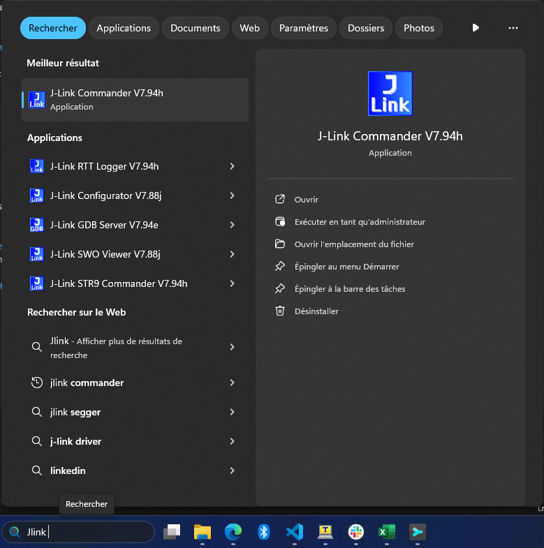

# Possible errors that could occur during MCUmgr usage

## A) When `mcumgr` command => `Acces is denied`

In most cases, you forgot to close the Serial Communication Port

## B) When `mcumgr` command => `NMP timeout`

Try to execute simpler command like

```bash
mcumgr -c <name> echo hello
```

If it happened try the failed command a second time, it could work now.
If it gives the same error, this is generally because the MCUmgr config in the `prj.conf` is badly set.

## C) When `mcumgr image update` command => Stuck at 0%

Try deactivate mass storage on device:

- Open Jlink Commander  

- Execute this command:

```bash
MSDDisable
```

Then retry to perform update.
If still stuck, do the following steps in the right order:

- Flash & Erase the application
  - If working with **NCS**:
    - A window could be printed while asking to `Recover` the target
    - Press `Flash & Recover`
  - If working with **Vanilla Zephyr**:
    - An error should be prompted
    - Enter the same command + add `--recover` at the end
    - Flash the bootloader
- Return to **Application transfer**
