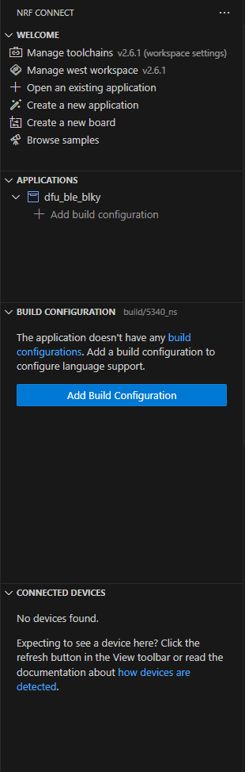
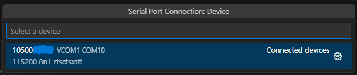
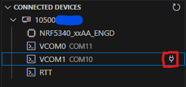
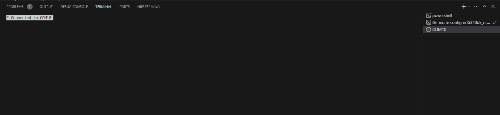
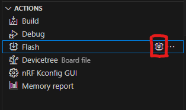
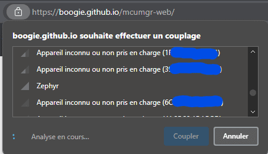
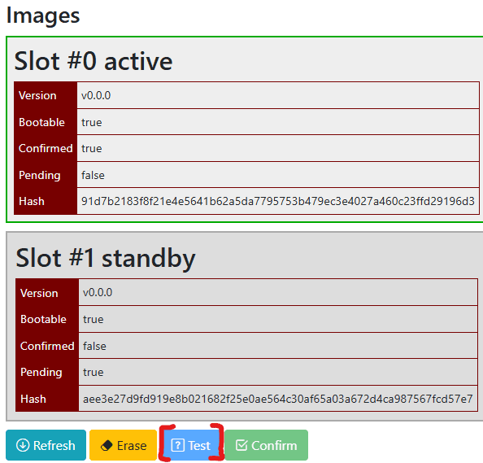
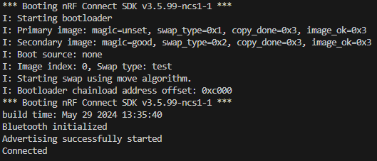
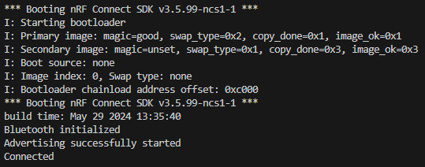

# Tutorial DFU over Bluetooth with Blinky sample

This tutorial will show:

- How to perform a DFU over Bluetooth
- How to use MCUmgr-Web
- With the Blinky sample

Things omitted for the sake of simplicity:

- Building the app as Non-Secure Processing Environment + TFM as Secure Processing Environment (could not make it work with this example)
- Custom keys (another tutorial is available)
- Thingy91 as a target (nRF52840 on the Thingy91 shall not be used for this purpose)
- Other OS than Windows

Before starting this tutorial, it is recommended to start with the ***other Bluetooth tutorial*** available [**here**](https://github.com/romaintrovallet/tutorials/blob/master/NCS_BLE_DFU.md).

It is also recommended to read the following links:

- [Zephyr's doc on MCUboot](https://docs.mcuboot.com/readme-zephyr.html)

This tutorial is made for NCS install.

It is not compatible with the zephyrproject install.

If you are interested by the zephyrproject / Vanilla Zephyr version.  
It is not available yet.

___

## 0) Requirements

This tutorial is made for NCS install.
You must have a NCS install that is already working.

With the global requirements, you should add the following:

- a phone with nRF Connect Application (available on Play Store / Apple Store)

or

- a Chromium based browser [Wikipedia Chromium (list is below)](https://en.wikipedia.org/wiki/Chromium_(web_browser))
- Cloning the [MCUmgr-Web Github](https://github.com/boogie/mcumgr-web)

___

## 1) Create Application

In nRF Connect for VS Code, create a new application.
Select one of the 2 button


You should have this window that pops up.  
We will create an app from an existing sample.  
Select the corresponding button


Then select the Blinky sample by searching `blinky`


Then save the app.
You should pick a high level folder because of the limit of 250 characters by CMake  
Furthermore, when you build the application you will have a `build` folder and within
a lots of folder and folder thus making the full path of certain files very long.

I choose this path for the example : `c:\ncs\apps\dfu_tutorial`
And I gave it the name `dfu_ble_blky`




This will be the application we are working with.

___

## 2) Modify Application

At this point you should have something like this:

```bash
.
└── dfu_tutorial/
    └── dfu_ble_blky/
        ├── src/
        │   └── main.c
        ├── .gitignore
        ├── CMakeLists.txt
        ├── prj.conf
        ├── README.rst
        └── sample.yaml
```

To make the DFU work, we will need to modify the application

### A) src/main.c

In your app folder, open `src/main.c`

Add these lines in the file => around line 9

```c
// BLE Stack
#include <zephyr/bluetooth/bluetooth.h>
#include <zephyr/bluetooth/hci.h>
// Advertising
#include <zephyr/bluetooth/uuid.h>
// Connection
#include <zephyr/bluetooth/conn.h>
```


Then these lines too => around line 29

```c
/*
 * Connection defines
 */
#define CONNECTION_STATUS_LED DT_ALIAS(led1)

/*
 * Advertising defines
 */
#define DEVICE_NAME             CONFIG_BT_DEVICE_NAME
#define DEVICE_NAME_LEN         (sizeof(DEVICE_NAME) - 1)

#define BT_UUID_TEST BT_UUID_128_ENCODE(0x4883d83f, 0x1e7e, 0x4200, 0xa406, 0x8a385b2ad20f)

/*
 * Connection global variables
 */
struct bt_conn *my_conn = NULL;
static const struct gpio_dt_spec connect_led = GPIO_DT_SPEC_GET(CONNECTION_STATUS_LED, gpios);

/*
 * Advertising struct
 */
static const struct bt_data ad[] = {
  BT_DATA_BYTES(BT_DATA_FLAGS, (BT_LE_AD_GENERAL | BT_LE_AD_NO_BREDR)),
  BT_DATA(BT_DATA_NAME_COMPLETE, DEVICE_NAME, DEVICE_NAME_LEN),
};

static const struct bt_data sd[] = {
  BT_DATA_BYTES(BT_DATA_UUID128_ALL, BT_UUID_TEST),
};

/*
 * Connection functions & struct
 */
/* Implement the callback functions */
void on_connected(struct bt_conn *conn, uint8_t err)
{
  if (err) {
    printk("Connection error %d\n", err);
    return;
  }
  printk("Connected\n");
  gpio_pin_set_dt(&connect_led, 1);
  my_conn = bt_conn_ref(conn);
}

void on_disconnected(struct bt_conn *conn, uint8_t reason)
{
  printk("Disconnected. Reason %d\n", reason);
  gpio_pin_set_dt(&connect_led, 0);
  bt_conn_unref(my_conn);
}

/* Declare the connection_callback structure */
struct bt_conn_cb connection_callbacks = {
  .connected              = on_connected,
  .disconnected           = on_disconnected,
};
```


And these lines in the main() => around line 101

```c
printk("build time: " __DATE__ " " __TIME__ "\n");

int err;
bt_conn_cb_register(&connection_callbacks);

err = bt_enable(NULL);
if (err) {
  printk("Bluetooth init failed (err %d)\n", err);
  return 0;
}
printk("Bluetooth initialized\n");

err = bt_le_adv_start(BT_LE_ADV_CONN, ad, ARRAY_SIZE(ad), sd, ARRAY_SIZE(sd));
if (err) {
  printk("Advertising failed to start (err %d)\n", err);
  return 0;
}
printk("Advertising successfully started\n");
```

You should have something like this:


Don't forget to save `src/main.c`!!

### B) prj.conf

Now open `prj.conf` and copy-paste the following lines.

```bash
# Enable MCUboot
CONFIG_BOOTLOADER_MCUBOOT=y

# Enable Bluetooth
CONFIG_BT=y

# Enable BT_FOTA through MCUmgr
CONFIG_NCS_SAMPLE_MCUMGR_BT_OTA_DFU=y

# Dependency for BT_OTA_DFU
CONFIG_BT_PERIPHERAL=y
```

You should have something like this:


Don't forget to save `prj.conf`!!

At this point you should have something like this:

```bash
.
└── dfu_tutorial/
    └── dfu_ble_blky/
        ├── src/
        │   └── main.c (M)
        ├── .gitignore
        ├── CMakeLists.txt
        ├── prj.conf (M)
        ├── README.rst
        └── sample.yaml
```

___

## 3) Build Application

Now we need to configure the build settings.
Select one of the 2 button


Select those 2 options and rename the output build folder to something recognizable.


If the build fails, try rebuild first (sometimes NCS needs a second build)
If it still fails, [check this](https://github.com/romaintrovallet/tutorials/blob/master/Errors_encountered/Build.md)

This takes quite some time to generate.
But after the generation you should have something like that.


___

## 4) Flash Application

Now is a good time to plug your device.

Once it is plugged and turned ON, you have 2 choices:

<details>
<summary><b>Open VSCode Serial Communication Port Reader</b></summary>

To see the log of our application, follow the steps:



For the next step the picture might not indicate what's to your screen.
Just go through the steps so you have the same configuration in the end.





</details>
</br>
<details>
<summary><b>Open your Serial Communication Port Reader</b></summary>

You have to find the used COM port (TeraTerm select it automatically)
And set the baud rate to `115200`

Once these 2 things are set, you are ready to flash

</details>
</br>

If ready, select the `Flash & Erase` command as presented below



If the flash was successful, you should see 3 things:

- A LED is blinking at a 1 sec rate
- The Serial log, itself composed of 2 parts:
  - The bootloader log
  - The application log
- Bluetooth
  - The device is visible
  - When connecting, LED2 is ON

The Serial log should be something like this


If you missed it, you can still press the `RESET` button
You should note the build time in the Serial Communication log
It's visible at the start of the application log

The `Connected` appears after you connect another device to the target.

___

## 5) Build Application again

At this point, you have a working bootloader and application
Now we will update the application with a new version of the same application

But you can also use another application
Just make sure to have (at least) the same configuration as presented in step 1

For this part, we will just rebuild (it's enough to see the difference)
But if you want a more visual approach, there are possibilities available below

<details>
<summary><b>Rebuild the same app</b></summary>
</br>
<details>
<summary><b>[OPTIONAL] Modify the app</b></summary>

You can modify the app to bring a more visually updated approach
Here are some examples :

- the blinking LED (led0 -> led3) (line XX in `src/main.c`)
- the blinking rate (1000 -> 100) (line XX in `src/main.c`)
- the name of the target on Bluetooth Network (add following lines in `prj.conf`)

```bash
# See effect of DFU
CONFIG_BT_DEVICE_NAME="Nordic_DFU_BLE_BLKY"
```

</details>
</br>

Rebuild by following the instructions below


</details>
</br>
<details>
<summary><b>[OPTIONAL] New app</b></summary>

Follow the **1) Create Application**
Instead get the `hello_world` sample
and save it to someplace findable: `apps/dfu_tutorial/hello_world`
then rename it to something recognizable: `apps/dfu_tutorial/dfu_ble_hw`

Follow the same modification in the **2) Modify Application**
and add this library in the `apps/dfu_tutorial/dfu_ble_hw/src/main.c`

```c
#include <zephyr/kernel.h>
```

Once done create the same Build Configuration as in **3) Build Application**

</details>

___

## 6) Perform DFU

At this point, we use either nRF Connect Application or MCUmgr-Web to perform the DFU over Bluetooth.
In this tutorial, MCUmgr-Web is the "Tool" used
If you prefer the application, refer to [this tutorial](https://github.com/romaintrovallet/tutorials/blob/master/NCS_BLE_DFU.md)

Just know that other tools exists
[List of Tools & Libraries to Perform Update](https://docs.zephyrproject.org/latest/services/device_mgmt/mcumgr.html#tools-libraries)

Go to your build folder (ex: `apps/dfu_tutorial/dfu_ble_blky/build/5340_ns`)  
If you built **[OPTIONAL] New app** (in the **5) Build Application again**)
You must go to the new application build folder

Check for the presence of `zephyr/app_update.bin`

MCUmgr Web will allow to perform DFU over BLE in Chromium based browser.
So make sure you are using a Chromium based browser.

Now there is 2 way to make the update,

- [use the website](https://boogie.github.io/mcumgr-web/)
- [clone the git + launch local server](https://github.com/boogie/mcumgr-web)

Both have been tested and are working !
Choose the one you prefer, i will use the website in this example.

Activate Bluetooth on your computer
And click the `Connect` button on the website.
You should be prompted with a pop-up listing all the device with Bluetooth activated around



Look for `Nordic LBS` like the image above.
And select it to pair to your device.

Once paired, this is what you should see


Click on `Choose a file` button ('Choisis un fichier' in the screenshot above)

Go to your build folder (ex: `apps/dfu_tutorial/dfu_ble/build/5340_ns`)
Select the file `zephyr/app_update.bin`

Once selected, you should see something like this


I have version `3.6.0`, it is because i've changed the file `VERSION` in the app folder.
In your case, just remember the 4 first characters of the hash.

The next step is to send the file to the target.
This is done by pressing the `Upload` button.

We now need to tell the Bootloader to exchange the images and apply the update.
It will be done in 2 steps.

The first one is to select the `Test` button on mcumgr-web



Now we need to reset the board.
It can be done via mcumgr, with the `Reset` button
Or with the onboard `Reset` button

Once it is done, we can head back to the terminal.

You should see the Bootloader swapping the image to another
The application loads with a more up to date Build Time



At this point, the second slot (the update) boots.
But if we do another Reset, the old application will be booted again.

To prevent this, it needs to be confirmed while running.

So if you Reverted the update to see what happened, perform the `Test` step again before going further.

You have to go back to mcumgr-web and press the `Confirm` button


Reset the board agains, and this time the application should not swap and still be the same build time.



You have now performed a DFU over Bluetooth starting from a Blinky sample !!
