# Tutorial DFU over Bluetooth with Peripheral LBS sample

This tutorial will show:

- How to perform a DFU over Bluetooth
- How to use nRF Connect Application
- Using the BLE Peripheral LBS sample

Things omitted for the sake of simplicity:

- The TF-M mode (could not make it work with this example)
- Custom keys (another tutorial is available)
- Thingy91 as a target (nRF852840 on the Thingy91 shall not be used for this purpose)
- Other OS than Windows

Before starting this tutorial, it is recommended to read the following links:

- [Zephyr's doc on MCUboot](https://docs.mcuboot.com/readme-zephyr.html)

___

## 0) Requirements

This tutorial is made for NCS install.
It is not compatible with the zephyrproject install.

If you are interested by the zephyrproject / Vanilla Zephyr version
It is not available yet.

With the global requirements, you should add the following:

- a phone with nRF Connect Application (available on Play Store / Apple Store)

___

## 1) Create application

In nRF Connect for VS Code, create a new application.
Select one of the 2 button

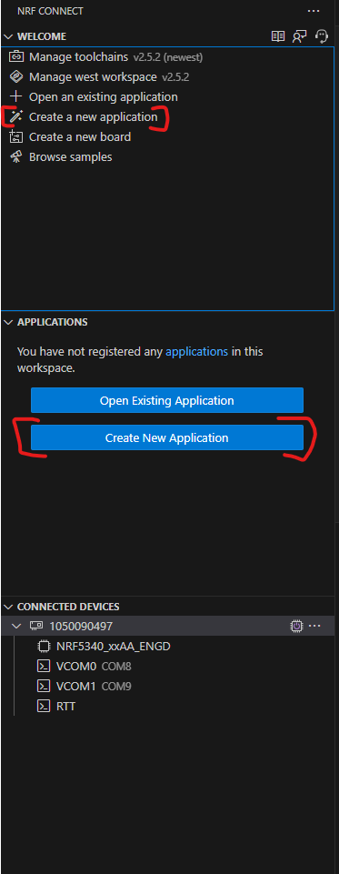

You should have this window that pops up.
We will create an app from an existing sample.
Select the correponding button

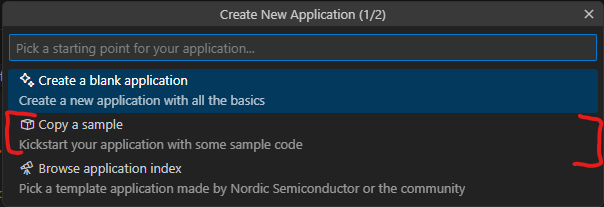

Then select the bt sample by searching `bluetooth/peripheral_lbs`

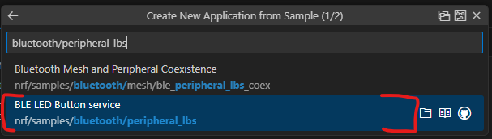

Then save the app.
You should pick a high level folder because of the limit of 250 characters by CMake
Furthermore, when you build the application you will have a `build` folder and within
a lots of folder and folder thus making the full path of certain files very long.

I choose this path for the example : `c:\ncs\myapps\`

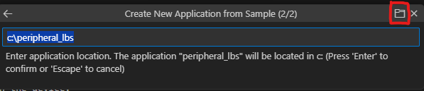

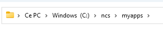

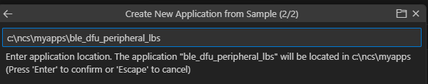

___

## 2) Open Application

Now we need to open the app.
Select one of the 2 button

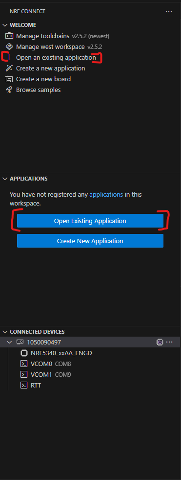

then select it in your windows browser

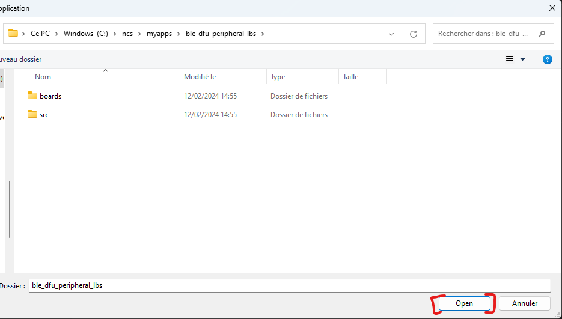

___

## 2) Modify Application

### A) src/main.c

In your app folder, open `src/main.c`

Add this line of code in the main() => around line 190

```c
printk("build time: " __DATE__ " " __TIME__ "\n");
```

This will allow us to see the difference between old and new code after the update.
You should have something like this:

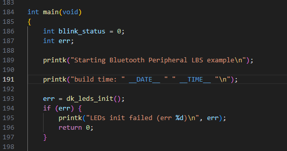

Don't forget to save !!

### B) prj.conf

Now open `prj.conf`

```bash
#Enable MCUBOOT bootloader build in the application
CONFIG_BOOTLOADER_MCUBOOT=y
#Include MCUMGR and the dependencies in the build
CONFIG_NCS_SAMPLE_MCUMGR_BT_OTA_DFU=y
```

You should have something like this:

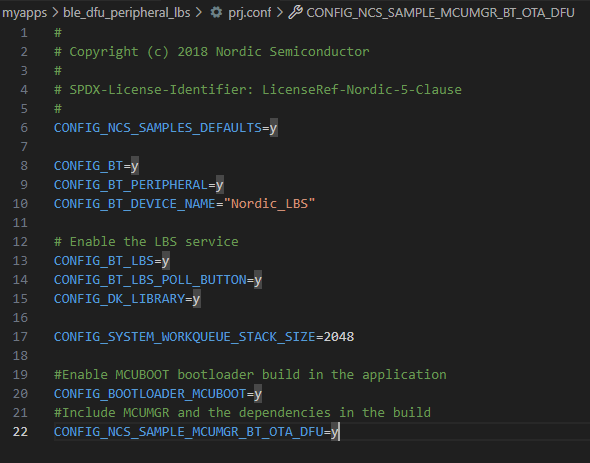

Don't forget to save !!

___

## 4) Build configuration

Now we need to configure the build settings.
Select one of the 2 button

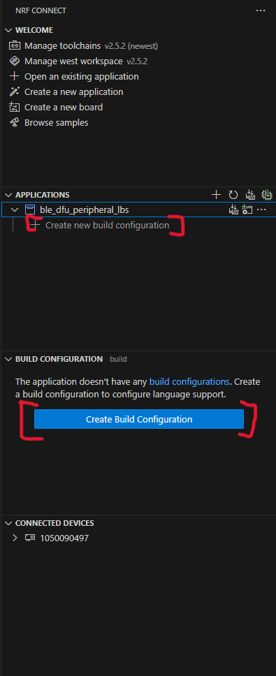

Select those 2 options and rename the output build folder to something recognizable.

At the time of making the tuto, a danger sign appears when selecting the board.
It's because of the secure and non-secure way to build the application.
If you have it too, look it up later


This takes quite some time to generate.
But after the generation you should have something like that.

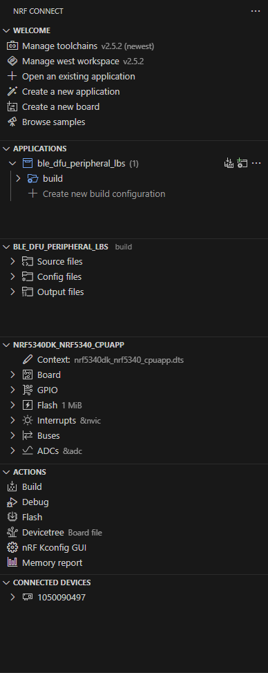

___

## 5) Flash the application

Now is a good time to plug your device.
If ready, flash your application as presented below.


___

## 6) Observe booting

To see the return of our application, follow the steps:


For the next step the picture might not indicate what's to your screen.
Just go through the steps so you have the same configuration in the end.

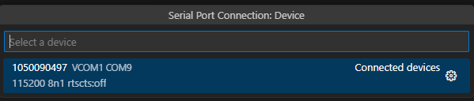  

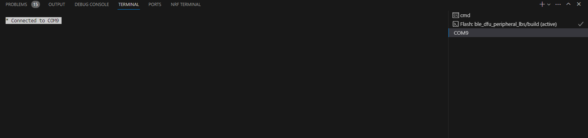  

Now press the `Reset Button` on the devkit.
And observe the boot sequence on the terminal.


What's to note is the build time of the application

___

## 7) Perform DFU

### A) New build + Send file to phone

First you need to rebuild your application, by pressing the following button

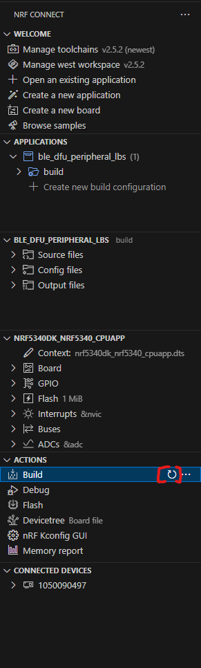

Now you should transfer the updated file to your phone.
It is located at `<path_to_app_foolder>\build\zephyr\app_update.bin`
I have chosen bluetooth.

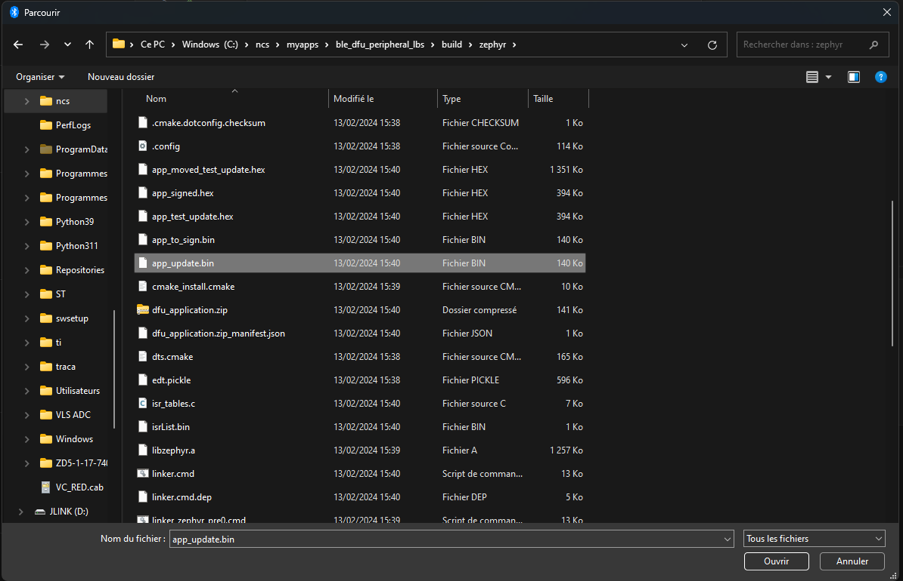

### B) Connect + Send file to device

<details>
<summary><b>Phone part</b></summary>

Now you have to open nRF Connect application on your phone.

Then connect to the the device

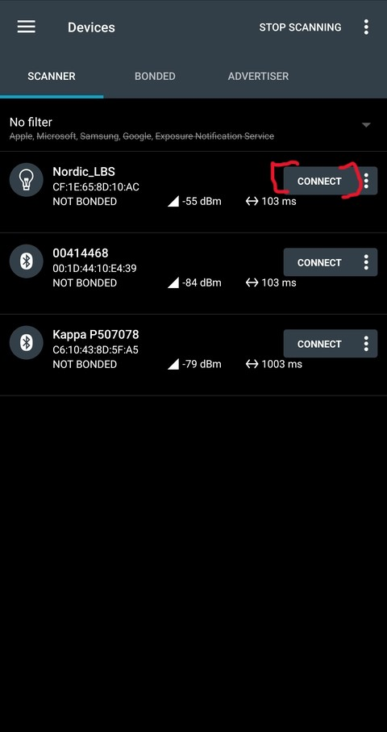

Then select `CONNECT` again in the top of the application.
You should now see the same things as the picture below.
Presss `DFU`

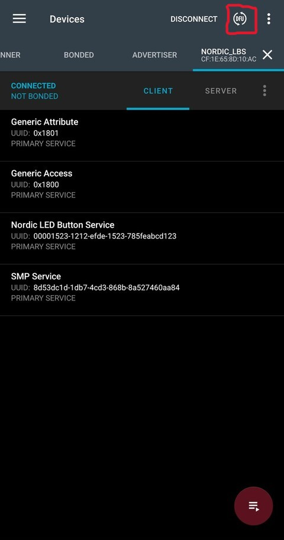

You are now headed to your file system, choose the app_update file.
Then select `Test and Confirm` and `OK`

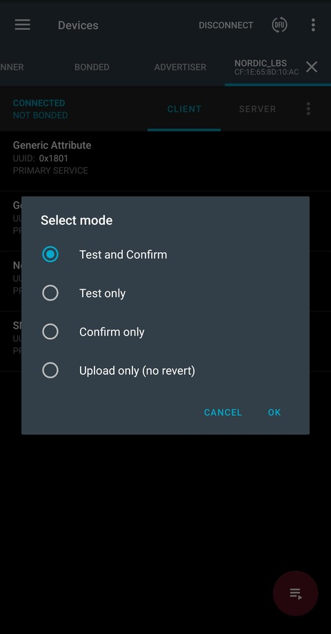

You should see the graph like the picture below.

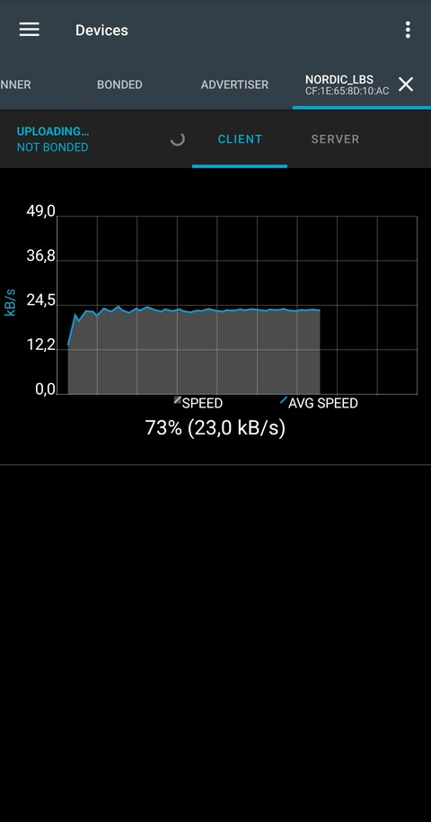

</details>

Once it is done, we can head back to the terminal.

<details>
<summary><b>Serial Result</b></summary>

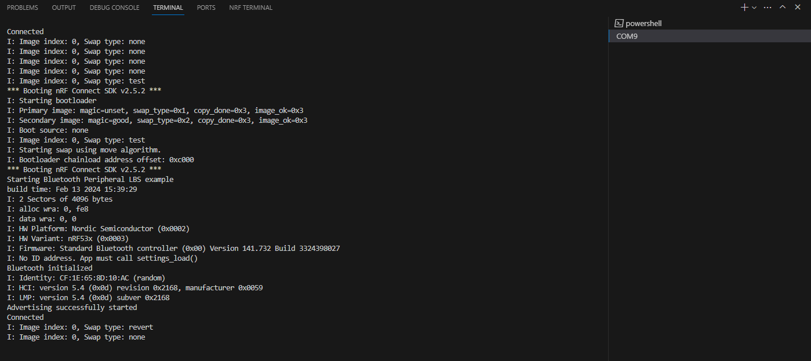

Where we can see the build time is different than the previous one

</details>
