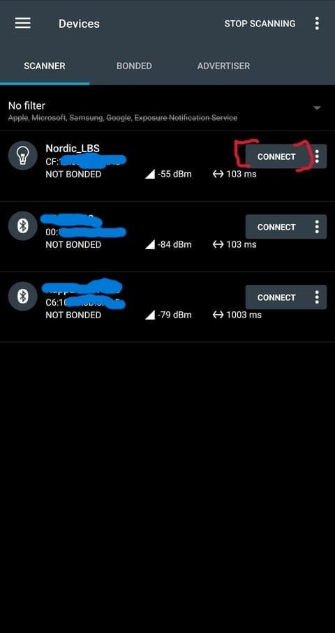
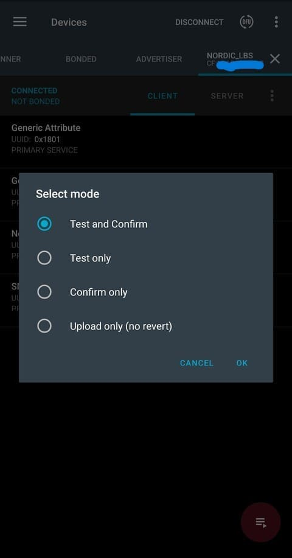
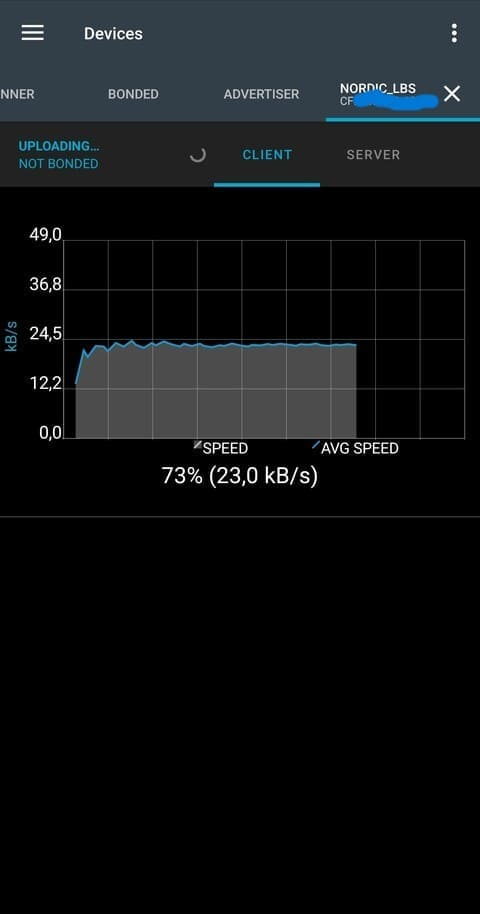

# Tutorial DFU over Bluetooth with Peripheral LBS sample

This tutorial will show:

- How to perform a DFU over Bluetooth
- How to use nRF Connect Application
- Using the BLE Peripheral LBS sample

Things omitted for the sake of simplicity:

- The TF-M mode (could not make it work with this example)
- Custom keys (another tutorial is available)
- Thingy91 as a target (nRF852840 on the Thingy91 shall not be used for this purpose)
- Other OS than Windows

Before starting this tutorial, it is recommended to read the following links:

- [Zephyr's doc on MCUboot](https://docs.mcuboot.com/readme-zephyr.html)

___

## 0) Requirements

This tutorial is made for NCS install.
It is not compatible with the zephyrproject install.

If you are interested by the zephyrproject / Vanilla Zephyr version
It is not available yet.

With the global requirements, you should add the following:

- a phone with nRF Connect Application (available on Play Store / Apple Store)

___

## 1) Create application

In nRF Connect for VS Code, create a new application.
Select one of the 2 button


You should have this window that pops up.
We will create an app from an existing sample.
Select the correponding button


Then select the bt sample by searching `bluetooth/peripheral_lbs`


Then save the app.
You should pick a high level folder because of the limit of 250 characters by CMake
Furthermore, when you build the application you will have a `build` folder and within
a lots of folder and folder thus making the full path of certain files very long.

I choose this path for the example : `c:\ncs\myapps\`


This will be the application we are working with.

___

## 2) Modify Application

To make the DFU work, we will need to modify the application

### A) src/main.c

In your app folder, open `src/main.c`

Add this line of code in the main() => around line 190

```c
printk("build time: " __DATE__ " " __TIME__ "\n");
```

This will allow us to see the difference between old and new code after the update.
You should have something like this:


Don't forget to save `src/main.c`!!

### B) prj.conf

Now open `prj.conf`

```bash
#Enable MCUBOOT bootloader build in the application
CONFIG_BOOTLOADER_MCUBOOT=y
#Include MCUMGR and the dependencies in the build
CONFIG_NCS_SAMPLE_MCUMGR_BT_OTA_DFU=y
```

You should have something like this:


Don't forget to save `prj.conf`!!

___

## 3) Build application

Now we need to configure the build settings.
Select one of the 2 button


Select those 2 options and rename the output build folder to something recognizable.

At the time of making the tuto, a danger sign appears when selecting the board.
It's because of the secure and non-secure way to build the application.
If you have it too, look it up later


This takes quite some time to generate.
But after the generation you should have something like that.


___

## 4) Flash the application

Now is a good time to plug your device.

Once it is plugged and turned ON, you have 2 choices:

<details>
<summary><b>Open VSCode Serial Communication Port Reader</b></summary>

To see the log of our application, follow the steps:


For the next step the picture might not indicate what's to your screen.
Just go through the steps so you have the same configuration in the end.


</details>
</br>
<details>
<summary><b>Open your Serial Communication Port Reader</b></summary>

You have to find the used COM port (TeraTerm select it automatically)
And set the baud rate to `115200`

Once these 2 things are set, you are ready to flash

</details>
</br>

If ready, select the `Flash & Erase` command as presented below


If the flash was successful, you should see 3 things:

- A LED is blinking at a 1 sec rate
- The Serial log, itself composed of 2 parts:
  - The bootloader log
  - The application log
- Bluetooth
  - The device is visible
  - When connecting, LED2 is ON

The Serial log should be something like this


If you missed it, you can still press the `RESET` button
What's to note is the build time of the application

___

## 5) Build Application again

At this point, you have a working bootloader and application
Now we will update the application with a new version of the same application

But you can also use another application
Just make sure to have (at least) the same configuration as presented in step 1

For this part, we will just rebuild (it's enough to see the difference)
But if you want a more visual approach, there are possibilities available below

<details>
<summary><b>Rebuild the same app</b></summary>
</br>
<details>
<summary><b>[OPTIONAL] Modify the app</b></summary>

You can modify the app to bring a more visually updated approach
Here are some examples :

- the blinking LED (DK_LED1 -> DK_LED4) (line 33 `src/main.c`)
- the blinking rate (1000 -> 100) (line 35 `src/main.c`)

</details>
</br>

Rebuild by following the instructions below


</details>
</br>
<details>
<summary><b>[OPTIONAL] New app</b></summary>

Not written yet

</details>

___

## 6) Perform DFU

At this point, we use nRF Connect app to perform the DFU over Bluetooth.
Just know that other tools exists
[List of Over The Air Update provided by Zephyr](https://github.com/zephyrproject-rtos/zephyr/blob/main/doc/services/device_mgmt/ota.rst)

### A) Send file to phone

Go to your build folder (ex: `myapps\ble_dfu_peripheral_lbs\build\zephyr`)
If you built **[OPTIONAL] New app** (in the **7) Build app again**
You must go to the new application build folder

Check for the presence of `app_update.bin`

Now you should transfer the updated file to your phone.
I have chosen bluetooth to send it to my phone.


### B) Connect + Send file to device

Now you have to open nRF Connect application on your phone.

Then connect to the the device



Then select `CONNECT` again in the top of the application.
You should now see the same things as the picture below.
Press `DFU`


You are now headed to your file system, choose the app_update file.
Then select `Test and Confirm` and `OK`



You should see the graph like the picture below.



Once it is done, we can head back to the terminal.


You should see the Bootloader swapping the image to another
And in the end the application load with a more up to date Build Time

You have now performed a DFU over Bluetooth !!

___

## 7) Possible errors

### A) Error when flashing the application

First verify that you have rightly plugged the Development Kit and that you have turned it on.
Then if a window is printed and asking to `Recover` the target
Press `Flash & Recover`

### B) No `app_update.bin` in the `build/zephyr` folder

If the console doesn't provide any error but you can't find the `app_update.bin`.
Just delete the `build` folder in your application.
You will need to recreate a new build configuration (select the same options).
And the file should be here
