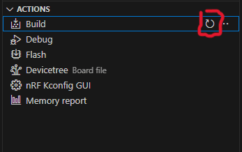

# Tutorial DFU over Bluetooth with Peripheral LBS sample

This tutorial will show:

- How to perform a DFU over Bluetooth
- How to use nRF Connect Application
- With the BLE Peripheral LBS sample

Things omitted for the sake of simplicity:

- Building the app as Non-Secure Processing Environment + TFM as Secure Processing Environment (could not make it work with this example)
- Custom keys (another tutorial is available)
- Thingy91 as a target (nRF52840 on the Thingy91 shall not be used for this purpose)
- Other OS than Windows

Before starting this tutorial, it is recommended to read the following links:

- [Zephyr's doc on MCUboot](https://docs.mcuboot.com/readme-zephyr.html)

This tutorial is made for NCS install.

It is not compatible with the zephyrproject install.

If you are interested by the zephyrproject / Vanilla Zephyr version.  
It is not available yet.

___

## 0) Requirements

This tutorial is made for NCS install.
You must have a NCS install that is already working.

With the global requirements, you should add the following:

- a phone with nRF Connect Application (available on Play Store / Apple Store)

or

- a Chromium based browser [Wikipedia Chromium (list is below)](https://en.wikipedia.org/wiki/Chromium_(web_browser))
- Cloning the [MCUmgr-Web Github](https://github.com/boogie/mcumgr-web)

___

## 1) Create Application

In nRF Connect for VS Code, create a new application.
Select one of the 2 button


You should have this window that pops up.  
We will create an app from an existing sample.  
Select the corresponding button


Then select the BLE LED Button Service sample by searching `plb`


Then save the app.
You should pick a high level folder because of the limit of 250 characters by CMake  
Furthermore, when you build the application you will have a `build` folder and within
a lots of folder and folder thus making the full path of certain files very long.

I choose this path for the example : `c:\ncs\apps\dfu_tutorial`
And I gave it the name `dfu_ble`


This will be the application we are working with.

___

## 2) Modify Application

At this point you should have something like this:

```bash
.
└── dfu_tutorial/
    └── dfu_ble/
        ├── boards/
        │   └── ...
        ├── src/
        │   └── main.c
        ├── .gitignore
        ├── CMakeLists.txt
        ├── Kconfig
        ├── Kconfig.sysbuild
        ├── prj_minimal.conf
        ├── prj.conf
        ├── README.rst
        ├── sample.yaml
        └── VERSION
```

To make the DFU work, we will need to modify the application

### A) src/main.c

In your app folder, open `src/main.c`

Add this line of code in the main() => around line 190

```c
printk("build time: " __DATE__ " " __TIME__ "\n\n");
```

This will allow us to see the difference between old and new code after the update.
You should have something like this:


Don't forget to save `src/main.c`!!

### B) prj.conf

Now open `prj.conf` and copy-paste the following lines.

```bash
# Enable MCUboot
CONFIG_BOOTLOADER_MCUBOOT=y

# Include MCUmgr and the dependencies in the build
CONFIG_NCS_SAMPLE_MCUMGR_BT_OTA_DFU=y
```

You should have something like this:


Don't forget to save `prj.conf`!!

At this point you should have something like this:

```bash
.
└── dfu_tutorial/
    └── dfu_ble/
        ├── boards/
        │   └── ...
        ├── src/
        │   └── main.c (M)
        ├── .gitignore
        ├── CMakeLists.txt
        ├── Kconfig
        ├── Kconfig.sysbuild
        ├── prj_minimal.conf
        ├── prj.conf (M)
        ├── README.rst
        ├── sample.yaml
        └── VERSION
```

___

## 3) Build Application

Now we need to configure the build settings.
Select one of the 2 button


Select those 2 options and rename the output build folder to something recognizable.


If the build fails, try rebuild first (sometimes NCS needs a second build)
If it still fails, [check this](https://github.com/romaintrovallet/tutorials/blob/master/Errors_encountered/Build.md)

This takes quite some time to generate.
But after the generation you should have something like that.


___

## 4) Flash Application

Now is a good time to plug your device.

Once it is plugged and turned ON, you have 2 choices:

<details>
<summary><b>Open VSCode Serial Communication Port Reader</b></summary>

To see the log of our application, follow the steps:


For the next step the picture might not indicate what's to your screen.
Just go through the steps so you have the same configuration in the end.


</details>
</br>
<details>
<summary><b>Open your Serial Communication Port Reader</b></summary>

You have to find the used COM port (TeraTerm select it automatically)
And set the baud rate to `115200`

Once these 2 things are set, you are ready to flash

</details>
</br>

If ready, select the `Flash & Erase` command as presented below


If the flash was successful, you should see 3 things:

- A LED is blinking at a 1 sec rate
- The Serial log, itself composed of 2 parts:
  - The bootloader log
  - The application log
- Bluetooth
  - The device is visible
  - When connecting, LED2 is ON

The Serial log should be something like this


If you missed it, you can still press the `RESET` button
You should note the build time in the Serial Communication log
It's visible at the start of the application log

___

## 5) Build Application again

At this point, you have a working bootloader and application
Now we will update the application with a new version of the same application

But you can also use another application
Just make sure to have (at least) the same configuration as presented in step 1

For this part, we will just rebuild (it's enough to see the difference)
But if you want a more visual approach, there are possibilities available below

<details>
<summary><b>Rebuild the same app</b></summary>
</br>
<details>
<summary><b>[OPTIONAL] Modify the app</b></summary>

You can modify the app to bring a more visually updated approach
Here are some examples :

- the blinking LED (DK_LED1 -> DK_LED4) (line 33 in `src/main.c`)
- the blinking rate (1000 -> 100) (line 35 in `src/main.c`)
- the name of the target on Bluetooth Network (Nordic_LBS -> Quasar_Concept) (line 10 in `prj.conf`)

</details>
</br>

Rebuild by following the instructions below



</details>
</br>
<details>
<summary><b>[OPTIONAL] New app</b></summary>

Not written yet.

</details>

___

## 6) Perform DFU

At this point, we either use nRF Connect application or MCUmgr-web to perform the DFU over Bluetooth.
In this tutorial, nRF Connect application is the "Tool" used
If you prefer MCUmgr-Web, refer to [this tutorial](https://github.com/romaintrovallet/tutorials/blob/master/NCS_BLE_BLINKY_DFU.md)

Just know that other tools exists
[List of Over The Air Update provided by Zephyr](https://github.com/zephyrproject-rtos/zephyr/blob/main/doc/services/device_mgmt/ota.rst)

Go to your build folder (ex: `apps/dfu_tutorial/dfu_ble/build/5340_ns`)

Check for the presence of `zephyr/app_update.bin`

<details>
<summary><b>With NRF Connect Application (with a phone)</b></summary>

### A) Send file to phone

Now transfer the updated file to your phone.
I do it via the Windows Bluetooth User Interface (fsquirt) to send it to my phone.


### B) Connect and Send file to device

Now you have to open nRF Connect application on your phone.

Then connect to the the device


Then select `CONNECT` again in the top of the application.
You should now see the same things as the picture below.
Press `DFU`


You are now headed to your file system, choose the app_update file.
Then select `Test and Confirm` and `OK`


You should see the graph like the picture below.


Once it is done, we can head back to the terminal.

You should see the Bootloader swapping the image to another
The application loads with a more up to date Build Time


</details>

You have now performed a DFU over Bluetooth !!
