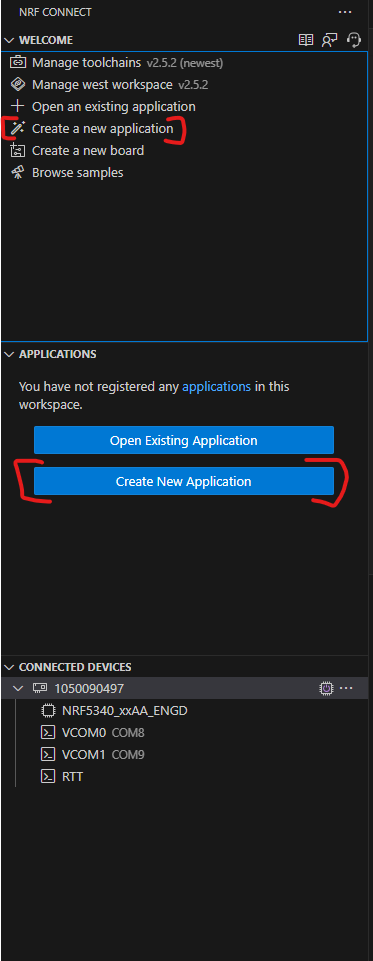
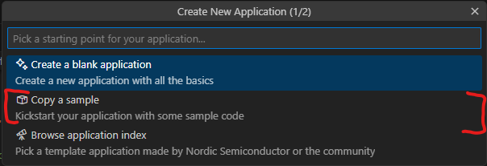
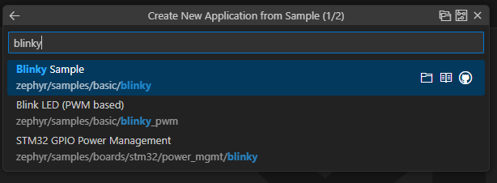
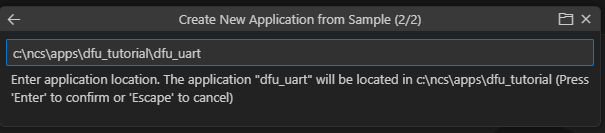
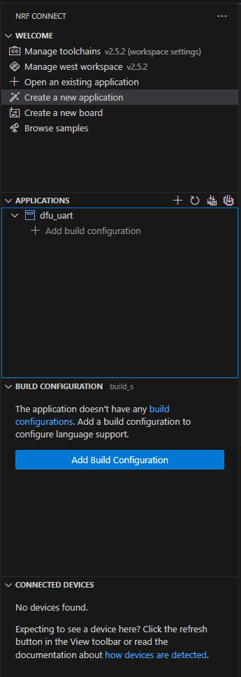
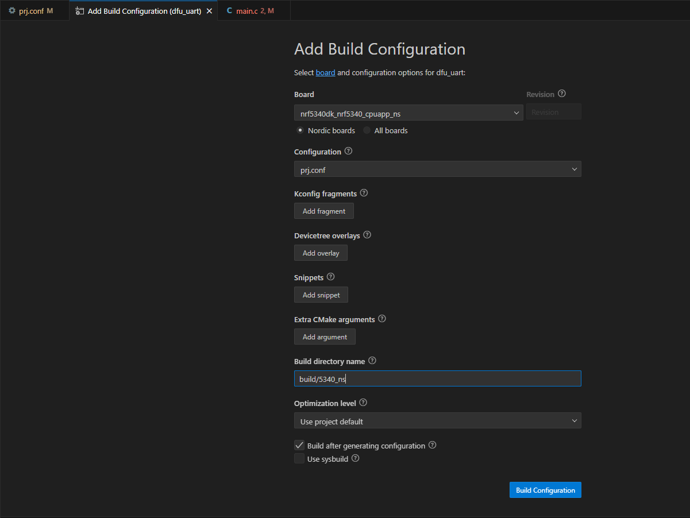
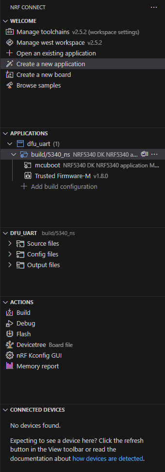
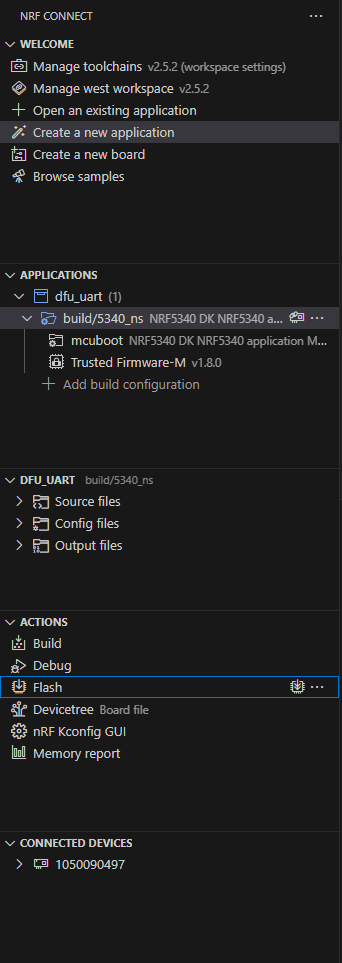
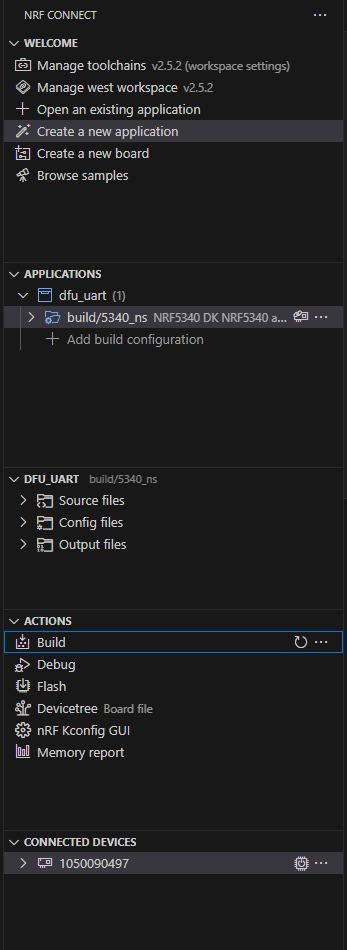
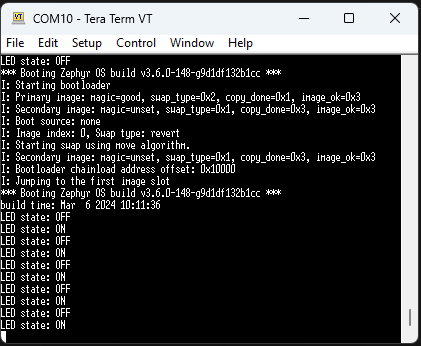

# Tutorial DFU over UART with Blinky sample

This tutorial will show:

- How to perform a DFU over UART
- How to use MCUmgr
- Using the Blinky sample

Things omitted for the sake of simplicity:

- The Secure mode (if working with Non-Secure mode(TF-M), Secure mod should be forgotten)
- Custom keys (another tutorial is available)
- Thingy91 as a target (another tutorial is available)
- Other OS than Windows

Before starting this tutorial, it is recommended to read the following links:

- [Zephyr's doc on MCUboot](https://docs.mcuboot.com/readme-zephyr.html)
- [Nordic's doc on MCUmgr](https://developer.nordicsemi.com/nRF_Connect_SDK/doc/latest/zephyr/services/device_mgmt/mcumgr.html)

___

## 0) Requirements

This tutorial is made for NCS install.
It is not compatible with the zephyrproject install.

If you are interested by the zephyrproject / Vanilla Zephyr version
It can be found [here](https://github.com/romaintrovallet/tutorials/blob/master/ZEPHYR_UART_DFU.md)

With the global requirements, you should add the following:

- Go + MCUmgr ([Go Install](https://go.dev/doc/install) + [MCUmgr from Zephyr](https://docs.zephyrproject.org/latest/services/device_mgmt/mcumgr.html))

___

## 1) Create application

In nRF Connect for VS Code, create a new application.
Select one of the 2 button



You should have this window that pops up.
We will create an app from an existing sample.
Select the correponding button



Then select the blinky sample by searching `blinky`



Then save the app.
You should pick a high level folder because of the limit of 250 characters by CMake
Furthermore, when you build the application you will have a `build` folder and within
a lots of folder and folder thus making the full path of certain files very long.

I choose this path for the example : `c:\ncs\apps\dfu_tutorial`
And I gave it the name `dfu_uart`




This will be the application we are working with.

___

## 2) Modify Application

At this point you should have something like this:

```bash
.
└── dfu_tutorial/
    └── dfu_uart/
        ├── src/
        │   └── main.c
        ├── .gitignore
        ├── CMakeLists.txt
        ├── prj.conf
        ├── README.rst
        └── sample.yaml
```

To make the DFU work, we will need to modify the application

### A) src/main.c

In your app folder, open `src/main.c`

Add this line of code in the main() => around line 25

```c
printk("build time: " __DATE__ " " __TIME__ "\n");
```

This will allow us to see the difference between old and new code after the update.
You should have something like this:


Don't forget to save `src/main.c`!!

### B) prj.conf

Now open `prj.conf`

```bash
CONFIG_BOOTLOADER_MCUBOOT=y

# Enable flash operations
CONFIG_FLASH=y

# Enable MCUmgr and dependencies
CONFIG_MCUMGR=y
CONFIG_NET_BUF=y
CONFIG_ZCBOR=y
CONFIG_CRC=y
CONFIG_STREAM_FLASH=y
CONFIG_FLASH_MAP=y

# Enable most core commands
CONFIG_IMG_MANAGER=y
CONFIG_MCUMGR_GRP_IMG=y
CONFIG_MCUMGR_GRP_OS=y

# Enable the serial mcumgr transport
CONFIG_MCUMGR_TRANSPORT_UART=y
CONFIG_BASE64=y
```

You should have something like this:


Don't forget to save `prj.conf`!!

### C) child_image/mcuboot.conf

You need to configure the log of MCUboot to see how it is done

In your app folder, create a folder named `child_image`
In this folder create a file named `mcuboot.conf`
And add this line inside the file

```bash
CONFIG_MCUBOOT_LOG_LEVEL_INF=y
```

This will allow us to have the details in the mcuboot part.

Don't forget to save `child_image/mcuboot.conf`!!

At this point you should have something like this:

```bash
.
└── dfu_tutorial/
    └── dfu_uart/
        ├── child_image/
        │   └── mcuboot.conf (U)
        ├── src/
        │   └── main.c (M)
        ├── .gitignore
        ├── CMakeLists.txt
        ├── prj.conf (M)
        ├── README.rst
        └── sample.yaml
```

___

## 3) Build application

Now we need to configure the build settings.
Select one of the 2 button



Select those 2 options and rename the output build folder to something recognizable.



If the build fails, try rebuild first (sometimes NCS needs a second build)
If it still fails, go to possible error section

This takes quite some time to generate.
But after the generation you should have something like that.



___

## 4) Flash the application

Now is a good time to plug your device.

Once it is plugged and turned ON, you have 2 choices:

<details>
<summary><b>Open VSCode Serial Communication Port Reader</b></summary>

Not written yet

</details>
</br>
<details>
<summary><b>Open your Serial Communication Port Reader</b></summary>

You have to find the used COM port (TeraTerm select it automatically)
And set the baud rate to `115200`

Once these 2 things are set, you are ready to flash

</details>
</br>

If ready, select the `Flash & Erase` command as presented below



If the flash was successful, you should see 2 things:

- A LED is blinking at a 1 sec rate
- The Serial log, itself composed of 2 parts:
  - The bootloader log
  - The appliction log

If you missed it, you can still press the `RESET` button
What's to note is the build time of the application

___

## 5) Build Application again

At this point, you have a working bootloader and application
Now we will update the application with a new version of the same application

But you can also use another application
Just make sure to have (at least) the same configuration as presented in step 1

For this part, we will just rebuild (it's enough to see the difference)
But if you want a more visual approach, there are possibilities available below

<details>
<summary><b>Rebuild the same app</b></summary>
</br>
<details>
<summary><b>[OPTIONAL] Modify the app</b></summary>

You can modify the app to bring a more visually updated approach
Here are some examples :

- the LED (led0 -> led1) (line 14 in `src/main.c`)
- the blinking rate (1000 -> 100) (line 11 in `src/main.c`)

</details>
</br>

Rebuild by following the instructions below



</details>
</br>
<details>
<summary><b>[OPTIONAL] New app</b></summary>

Follow the **1) Create application**
Instead get the `hello_world`
and copy it to `apps\dfu_tutorial\hello_world`

Follow the same modification in the **2) Modify application**
and add this library in the `apps\dfu_tutorial\hello_world\src\main.c`

```c
#include <zephyr/kernel.h>
```

Once done create the same Build Configuration as in **3) Build configuration**

</details>

___

## 6) Perform DFU

At this point, we use MCUmgr to perform the DFU over UART.
Just know that other tools exists
[List of Over The Air Update provided by Zephyr](https://github.com/zephyrproject-rtos/zephyr/blob/main/doc/services/device_mgmt/ota.rst)

### A) Only For First Time

Open another terminal wherever you want
In the following, it will be called the **CONFIG_TERMINAL**

<details>
<summary><b>MCUmgr Install Verification</b></summary>

MCUmgr will use the Serial Communication Port

- Close your Serial Communication Port
- Go to your build folder (example : `apps/dfu_tutorial/dfu_uart/build/5340_ns`)
  - then `zephyr` folder
  - then verify the presence of `app_update.bin`

In the **CONFIG_TERMINAL**

```bash
mcumgr version
```

and you should get

```bash
mcumgr 0.0.0-dev
```

This verifies your installation of MCUmgr

</details>
</br>
<details>
<summary><b>First MCUmgr config</b></summary>

In the **CONFIG_TERMINAL**

```bash
nrfutil device list
```

and the result should be something like this:

```bash
1050090497    COM11    VCOM0
1050090497    COM10    VCOM1
```

It is normal if you only have one (it will be easier)
This allow us to get the connected serial communication port that are available
Replace the `<name>` and the `COMXX` before copy the next command in the **CONFIG_TERMINAL**

```bash
mcumgr conn add <name> type=serial connstring=COMXX
```

Now to test if you have correctly setup your serial connection
Close any Serial Communication Port that could be open
Copy this command to the **CONFIG_TERMINAL**

```bash
mcumgr -c <name> echo hello
```

You should receive `hello` almost instantly, if not see possible errors
If you do not have any error, you can try the next one

```bash
mcumgr -c <name> image list
```

You should have a list of details on the current image on the slot

</details>
</br>

At this point you can close **CONFIG_TERMINAL**

### B) Application transfer

Go to your build folder (ex: `apps\dfu_tutorial\blinky\build\5340_ns`)
If you built **[OPTIONAL] New app** (in the **5) Build app again**
You must go to the new application build folder

Check for the presence of `app_update.bin`

Open a new Terminal in the build folder folder
In the following, it will be called the **COMM_TERMINAL**

Adapt and copy this command:

```bash
mcumgr -c <name> image list
```

(If you don't know what 'name' is, go to **First Config**)
You should have the list of the image

Adapt and copy this command:

```bash
mcumgr -c <name> image upload -e zephyr/app_update.bin
```

Now you should be printed with a loading bar.
In this project, the loading should take around 15-20 seconds
Once the upload done, we check the presence of the image

Enter this command in the **COMM_TERMINAL**

```bash
mcumgr -c <name> image list
```

You should see 2 images in 2 slots (slot0 and slot1)
At this point 2 images are on the target
But the original one will always be selected with each reset
Let's modify this


### C) Application swap

Copy the hash of the second image
Then adapt and enter this command in the **COMM_TERMINAL**

```bash
mcumgr -c <name> image test <hash>
```

Now open a Serial COM port (ex: TeraTerm)

And press the `RESET` on your board
You should see the Bootloader swpping the image to another
And in the end the application load with a more up to date Build Time


Press the `RESET` button again on your board
Now the application loading is the original



Close the Serial COM port

Enter this command

```bash
mcumgr -c <name> image confirm <hash>
```

Now open a Serial COM port

After pressing the `RESET` button
And now you can see the new application booting again
Only this time, when you press the `RESET` button again
It still boots on the most up to date image

You have now performed your first DFU !!

You can play with the 2 pictures that are on the target
You have to copy the hashs of the original image
And follow the same step as above.

If you don't want to press the `RESET` button anymore
You can force the reset with this command

```bash
mcumgr -c <name> reset
```

And even optimizing the whole process with one command

```bash
mcumgr -c <name> image confirm <hash> && mcumgr -c <name> reset
```

___

## 7) Possible errors

### A) FAIL at Build => No configure step for 'tfm'

Relaunch the pristine build, it should work (no idea why it fails no the first try)

### B) Error when flashing the application

First verify that you have rightly plugged the Development Kit and that you have turned it on.
Then if a window is printed and asking to `Recover` the target
Press `Flash & Recover`

### C) No `app_update.bin` in the `build/zephyr` folder

If the console doesn't provide any error but you can't find the `app_update.bin`.
Just delete the `build` folder in your application.
You will need to recreate a new build configuration (select the same options).
And the file should be here

### D) When `mcumgr` command => `Acces is denied`

In most cases, you forgot to close the Serial Communication Port

### E) When `mcumgr` command => `NMP timeout`

Try to execute simpler command like

```bash
mcumgr -c <name> echo hello
```

If it happened try the failed command a second time, it could work now.
If it doesn't work, this is generally because the MCUmgr config in the `prj.conf` is badly set.

### F) When `mcumgr image update` command => Stuck at 0%

Try deactivate mass storage on device:

- Open Jlink Commander

- Execute this command:

```bash
MSDDisable
```

Then retry to perform update.
If still stuck, do the following steps in the right order:

- Flash & Erase the application
- A window could be printed while asking to `Recover` the target
- Press `Flash & Recover`
- ***At this point the device is locked, we need to recover it***
- Return to **Application transfer**
