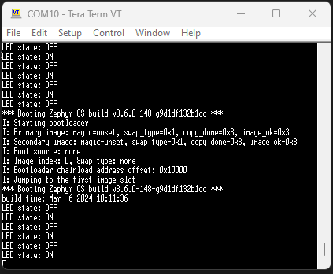
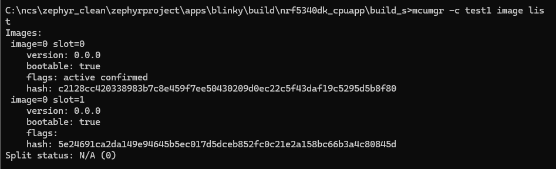
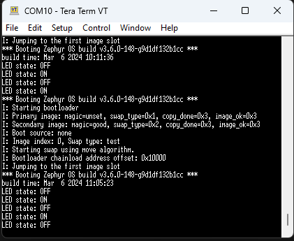
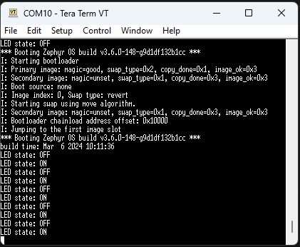

# Tutorial DFU over UART with Blinky sample

This tutorial will show:

- How to perform a DFU over UART
- How to use MCUmgr
- Using the Blinky sample

Things omitted for the sake of simplicity:

- Use of NCS for VSCode app
- The TF-M mode (could not make it work with Vanilla Zephyr)
- Custom keys (another Markdown is available)
- Thingy91 as a target (could not make it work with Vanilla Zephyr)
- Other OS than Windows

Before starting this tutorial, it is recommended to read the following links:

- [Zephyr's doc on MCUboot](https://docs.mcuboot.com/readme-zephyr.html)
- [Nordic's doc on MCUmgr](https://developer.nordicsemi.com/nRF_Connect_SDK/doc/latest/zephyr/services/device_mgmt/mcumgr.html)

___

## 0) Requirements

This tutorial is made for zephyrproject + zephyr SDK install
But it can be used with Zephyr version of NCS
Just replace `zephyrproject` with your toolchain version (ex:`v2.6.0`)
(Not recommended if you have a zephyrproject install)

If you are interested by the NCS version.  
It can be found [here](https://github.com/romaintrovallet/tutorials/blob/master/NCS_UART_DFU.md)

With the global requirements, you should add the following:

- Go + MCUmgr ([Go Install](https://go.dev/doc/install) + [MCUmgr from Zephyr](https://docs.zephyrproject.org/latest/services/device_mgmt/mcumgr.html))

___

## 1) Create Application

Go to your zephyrproject install.
Go to this path : `zephyrproject\zephyr\samples\basic`
Copy the `blinky` folder
Paste it in your app folder (ex: `zephyrproject\apps\blinky`)
For the next steps, we will assume you pick the example folder

This will be the application we are working with.

___

## 2) Modify Application

To make the DFU work, we will need to modify the application

### A) src/main.c

In your app folder, open `src/main.c`

Add this line of code in the main() => around line 25

```c
printk("build time: " __DATE__ " " __TIME__ "\n");
```

This will allow us to see the difference between old and new code after the update.
You should have something like this:


Don't forget to save `src/main.c`!!

### B) prj.conf

Now open `prj.conf`

```bash
# Print a banner on the UART on startup.
CONFIG_BOOT_BANNER=y
CONFIG_BOOTLOADER_MCUBOOT=y
CONFIG_MCUBOOT_SIGNATURE_KEY_FILE="bootloader/mcuboot/root-rsa-2048.pem"

# Enable flash operations
CONFIG_FLASH=y

# Enable MCUmgr and dependencies
CONFIG_MCUMGR=y
CONFIG_NET_BUF=y
CONFIG_ZCBOR=y
CONFIG_CRC=y
CONFIG_STREAM_FLASH=y
CONFIG_FLASH_MAP=y

# Enable most core commands
CONFIG_IMG_MANAGER=y
CONFIG_MCUMGR_GRP_IMG=y
CONFIG_MCUMGR_GRP_OS=y

# Enable the serial mcumgr transport
CONFIG_MCUMGR_TRANSPORT_UART=y
CONFIG_BASE64=y
CONFIG_CONSOLE=y
```

Don't forget to save `prj.conf`!!

___

## 3) Command Line config

In this tutorial we will use the command line
Open a terminal in the parent folder of `zephyrproject`

If, for whatever reason, you cannot complete the whole tuto in one time.
If you must build any application/bootloaders (Until Step 7 included)
You need to make this step all over again

In the following, it will be called the **MAIN_TERMINAL**

Enter this command:

```bash
echo %ZEPHYR_BASE%
```

and it should return something like this:

```bash
<absolute>\<path>\<to>\zephyrproject\zephyr
```

If not go to error section

Still in the **MAIN_TERMINAL**, enter this command:

```bash
zephyrproject\.venv\Scripts\activate.bat
```

You are now in the zephyr virtual environment.
You shall keep your **MAIN_TERMINAL** open.

Enter the following commands:

```bash
cd zephyrproject
```

```bash
west update
```

```bash
west zephyr-export
```

Once done, keep it in your background and please do not close it
___

## 4) Build application

In the **MAIN_TERMINAL**

Enter this command :

```bash
west build -b nrf5340dk_nrf5340_cpuapp apps/blinky -d apps/blinky/build/nrf5340dk_cpuapp/build_s
```

___

## 5) Build bootloader

In the **MAIN_TERMINAL**

Enter this command :

```bash
west build -b nrf5340dk_nrf5340_cpuapp bootloader/mcuboot/boot/zephyr -d build_bootloader/nrf5340dk_cpuapp
```

___

## 6) Flash application

Now is a good time to plug your device

In the **MAIN_TERMINAL**

Enter this command :

```bash
west flash -d apps/blinky/build/nrf5340dk_cpuapp/build_s
```

If it doesn't flash, go to possible errors sections

At this point you should open a Serial Communication Port Reader to see the incoming output
Note that, at this point, you shouldn't see anything related to this application.

___

## 7) Flash bootloader

In the **MAIN_TERMINAL**

Enter this command :

```bash
west flash -d build_bootloader/nrf5340dk_cpuapp
```

If the flash was successful, you should see 2 things:

- A LED is blinking at a 1 sec rate
- The Serial log, itself composed of 2 parts:
  - The bootloader log
  - The application log

If you missed it, you can still press the `RESET` button
You should note the build time in the Serial Communication log
It's visible at the start of the application log



___

## 8) Build Application again

At this point, you have a working bootloader and application
Now we will update the application with a new version of the same application

But you can also use another application
Just make sure to have (at least) the same configuration as presented in step 1

For this part, we will just rebuild (it's enough to see the difference)
But if you want a more visual approach, there are possibilities available below

<details>
<summary><b>Rebuild the same app</b></summary>
</br>
<details>
<summary><b>[OPTIONAL] Modify the app</b></summary>

You can modify the app to bring a more visually updated approach
Here are some examples :

- the LED (led0 -> led1) (line 15 in `src/main.c`)
- the blinking rate (1000 -> 100) (line 15 in `src/main.c`)

</details>
</br>

In the **MAIN_TERMINAL**

Enter this command :

```bash
west build -b nrf5340dk_nrf5340_cpuapp apps/blinky -d apps/blinky/build/nrf5340dk_cpuapp/build_s -p
```

</details>
</br>
<details>
<summary><b>[OPTIONAL] New app</b></summary>

Follow the **A) Copy sample** in the **1) Create Application**
Instead get the `zephyrproject\zephyr\samples\hello_world`
and copy it to `zephyrproject\apps\hello_world`

Follow the same modification in the **2) Modify Application**
and add this library in the `zephyrproject\apps\hello_world\src\main.c`

```c
#include <zephyr/kernel.h>
```

In the **MAIN_TERMINAL**

Then build it with this command

```bash
west build -b nrf5340dk_nrf5340_cpuapp apps/hello_world -d apps/hello_world/build/nrf5340dk_cpuapp/build_s
```

</details>

___

## 9) Perform DFU

At this point, we use MCUmgr to perform the DFU over UART.
Just know that other tools exists
[List of Over The Air Update provided by Zephyr](https://github.com/zephyrproject-rtos/zephyr/blob/main/doc/services/device_mgmt/ota.rst)

### A) Only for First Time with MCUmgr

Open another terminal wherever you want
In the following, it will be called the **CONFIG_TERMINAL**

<details>
<summary><b>MCUmgr Install Verification</b></summary>

MCUmgr will use the Serial Communication Port

- Close your Serial Communication Port
- Go to your build folder (example : `zephyrproject/apps/blinky/build/nrf5340dk_cpuapp/build_s`)
  - then `zephyr` folder
  - then verify the presence of `zephyr.signed.bin`

In the **CONFIG_TERMINAL**

```bash
mcumgr version
```

and you should get

```bash
mcumgr 0.0.0-dev
```

This verifies your installation of MCUmgr

</details>
</br>
<details>
<summary><b>First MCUmgr config</b></summary>

In the **CONFIG_TERMINAL**

```bash
nrfutil device list
```

and the result should be something like this:

```bash
1050090497    COM11    VCOM0
1050090497    COM10    VCOM1
```

It is normal if you only have one (it will be easier)
This allow us to get the connected serial communication port that are available
Replace the `<name>` and the `COMXX` before copy the next command in the **CONFIG_TERMINAL**

```bash
mcumgr conn add <name> type=serial connstring=COMXX
```

Now to test if you have correctly setup your serial connection
Close any Serial Communication Port that could be open
Copy this command to the **CONFIG_TERMINAL**

```bash
mcumgr -c <name> echo hello
```

You should receive `hello` almost instantly, if not see possible errors
If you do not have any error, you can try the next one

```bash
mcumgr -c <name> image list
```

You should have a list of details on the current image on the slot

</details>
</br>

At this point you can close **CONFIG_TERMINAL**

### B) Application transfer

Go to your build folder (ex: `zephyrproject\apps\blinky\build\nrf5340dk_cpuapp\build_s`)  
If you built **[OPTIONAL] New app** (in the **5) Build app again**)
You must go to the new application build folder

Check for the presence of `zephyr\zephyr.signed.bin`

***Close any Serial COM port Reader***

Open a new Terminal in the build folder folder
In the following, it will be called the **COMM_TERMINAL**

Adapt and copy this command:

```bash
mcumgr -c <name> image list
```

(If you don't know what 'name' is, go to **First MCUmgr Config**)  
You should have the list of images that are on target

Adapt and copy this command:

```bash
mcumgr -c <name> image upload -e zephyr/zephyr.signed.bin
```

Now you should be printed with a loading bar.
In this project, the loading should take around 15-20 seconds
Once the upload done, we check the presence of the image

Enter this command in the **COMM_TERMINAL**

```bash
mcumgr -c <name> image list
```

You should see 2 images in 2 slots (slot0 and slot1)
At this point 2 images are on the target
But the original one will always be selected with each reset
Let's modify this



### C) Application swap

Copy the hash of the second image
Then adapt and enter this command in the **COMM_TERMINAL**

```bash
mcumgr -c <name> image test <hash>
```

Now open a Serial COM port (ex: TeraTerm)

And press the `RESET` on your board
You should see the Bootloader swpping the image to another
And in the end the application load with a more up to date Build Time



Press the `RESET` button again on your board
Now the application loading is the original



Close the Serial COM port

Enter this command

```bash
mcumgr -c <name> image confirm <hash>
```

Now open a Serial COM port

After pressing the `RESET` button
And now you can see the new application booting again
Only this time, when you press the `RESET` button again
It still boots on the most up to date image

You have now performed a DFU over UART!!

You can play with the 2 images that are on the target
You have to copy the hashs of the original image
And follow the same step as above.

If you don't want to press the `RESET` button anymore
You can force the reset with this command
Don't forget to **close any Serial COM port Reader** when you use MCUmgr CLI

```bash
mcumgr -c <name> reset
```

And even optimizing the whole process with one command

```bash
mcumgr -c <name> image confirm <hash> && mcumgr -c <name> reset
```
