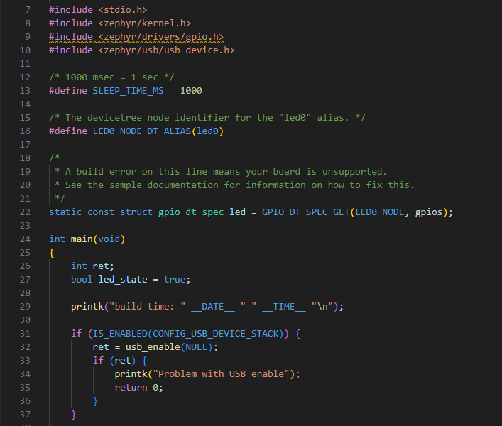
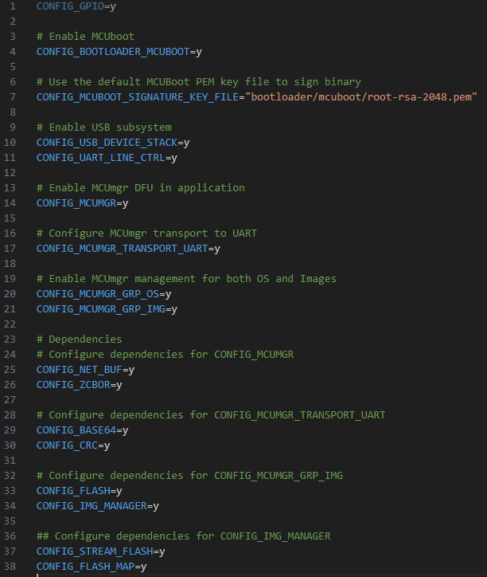
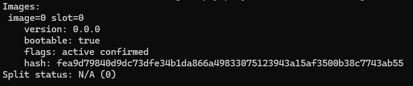
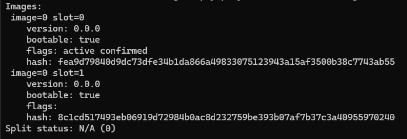

# Tutorial DFU over USB-CDC with Blinky sample

This tutorial will show:

- How to perform a DFU over USB-CDC
- How to use MCUmgr
- With the Blinky sample

Things omitted for the sake of simplicity:

- Use of NCS for VSCode app
- Building the app as Non-Secure Processing Environment + TFM as Secure Processing Environment (could not make it work with Vanilla Zephyr)
- Custom keys (another tutorial is available)
- Thingy91 as a target (could not make it work with Vanilla Zephyr)
- Other OS than Windows

Before starting this tutorial, it is recommended to read the following links:

- [Zephyr's doc on MCUboot](https://docs.mcuboot.com/readme-zephyr.html)
- [Nordic's doc on MCUmgr](https://developer.nordicsemi.com/nRF_Connect_SDK/doc/latest/zephyr/services/device_mgmt/mcumgr.html)

This tutorial is made for zephyrproject + zephyr SDK install

But it can be used with Zephyr version of NCS
**Not recommended if you have a zephyrproject install**
Just replace `zephyrproject` with your toolchain version (ex:`v2.6.0`)

If you are interested by the "official" NCS version.  
It can be found [here](https://github.com/romaintrovallet/tutorials/blob/master/NCS_USB-CDC_DFU.md)  
___

## 0) Requirements

This tutorial is made for zephyrproject + zephyr SDK install
You must have a zephyrproject install that is proven to work.

With the global requirements, you should add the following:

- a second USB cable
- Go + MCUmgr ([Go Install](https://go.dev/doc/install) + [MCUmgr from Zephyr](https://docs.zephyrproject.org/latest/services/device_mgmt/mcumgr.html))

___

## 1) Create Application

Go to your zephyrproject install.
Go to this path : `zephyrproject/zephyr/samples/basic`
Copy the `blinky` folder

Paste it in your app folder (ex: `zephyrproject/dfu_tutorial/blinky`)
Rename it to a more appropriate name (ex: `zephyrproject/dfu_tutorial/dfu_usb-cdc`)
For the next steps, we will assume you pick the example folder

This will be the application we are working with.

___

## 2) Modify Application

At this point you should have something like this:

```bash
.
└── dfu_tutorial/
    └── dfu_usb-cdc/
        ├── src/
        │   └── main.c
        ├── .gitignore
        ├── CMakeLists.txt
        ├── prj.conf
        ├── README.rst
        └── sample.yaml
```

To make the DFU work, we will need to modify the application

### A) src/main.c

In your app folder, open `src/main.c`

Add this line of code in the file => around line 10

```c
#include <zephyr/usb/usb_device.h>
```

And these lines of code in the main() => around line 29

```c
printk("build time: " __DATE__ " " __TIME__ "\n");

if (IS_ENABLED(CONFIG_USB_DEVICE_STACK)) {
    ret = usb_enable(NULL);
    if (ret) {
        printk("Problem with USB enable");
        return 0;
    }
}
```

This will allow us to see the difference between old and new code after the update.
You should have something like this:



Don't forget to save `src/main.c`!!

### B) prj.conf

Now open `prj.conf` and copy-paste the following lines.

```bash
# Enable MCUboot
CONFIG_BOOTLOADER_MCUBOOT=y

# Path to custom key
CONFIG_MCUBOOT_SIGNATURE_KEY_FILE="bootloader/mcuboot/root-rsa-2048.pem"

# Enable USB subsystem
CONFIG_USB_DEVICE_STACK=y
CONFIG_UART_LINE_CTRL=y

# Enable MCUmgr DFU in application
CONFIG_MCUMGR=y

# Configure MCUmgr transport to UART
CONFIG_MCUMGR_TRANSPORT_UART=y

# Enable MCUmgr management for both OS and Images
CONFIG_MCUMGR_GRP_OS=y
CONFIG_MCUMGR_GRP_IMG=y

# Dependencies
# Configure dependencies for CONFIG_MCUMGR
CONFIG_NET_BUF=y
CONFIG_ZCBOR=y

# Configure dependencies for CONFIG_MCUMGR_TRANSPORT_UART
CONFIG_BASE64=y
CONFIG_CRC=y

# Configure dependencies for CONFIG_MCUMGR_GRP_IMG
CONFIG_FLASH=y
CONFIG_IMG_MANAGER=y

## Configure dependencies for CONFIG_IMG_MANAGER
CONFIG_STREAM_FLASH=y
CONFIG_FLASH_MAP=y
```

You should have something like this:



Don't forget to save `prj.conf`!!

### C) nrf5340dk_nrf5340_cpuapp.overlay

Create a file named `nrf5340dk_nrf5340_cpuapp.overlay` at the project root
And add this code inside the file

```bash
/* Choose CDC ACM for MCUmgr */
/ {
  chosen {
    zephyr,uart-mcumgr = &cdc_acm_uart0;
  };
};

/* Configure CDC ACM */
&zephyr_udc0 {
  cdc_acm_uart0: cdc_acm_uart0 {
    compatible = "zephyr,cdc-acm-uart";
  };
};
```

This will give access to the usb port.

Don't forget to save `nrf5340dk_nrf5340_cpuapp.overlay`!!

### D) child_image/mcuboot.conf

In your app folder, create a folder named `child_image`
In this folder create a file named `mcuboot.conf`
And add these lines inside the file

```bash
# Enable logging for MCUboot
CONFIG_LOG=y
CONFIG_MCUBOOT_LOG_LEVEL_INF=y

# Configure serial recovery to use CDC_ACM, which by default uses the USB
CONFIG_BOOT_SERIAL_CDC_ACM=y

# Increase flash space for MCUboot child image, to fit USB drivers
# Size depends on your taget : 0x15000 is for nrf5340dk 
CONFIG_PM_PARTITION_SIZE_MCUBOOT=0x15000
```

This will allow us to have the details in the MCUboot part.
It will also allow the bootloader to have access to the USB stack.

Allowing the access means the bootloader's size is increased.
The partition size for the bootloader needs to be increased.
The value depends on your target [More details here (Step 3)](https://academy.nordicsemi.com/courses/nrf-connect-sdk-intermediate/lessons/lesson-8-bootloaders-and-dfu-fota/topic/exercise-2-dfu-over-usb-adding-external-flash/)
As I have a nrf5340dk, I will set the value to `0x15000`.

Don't forget to save `child_image/mcuboot.conf`!!

### E) CMakeLists.txt

Modifying this file allow to automate the building with the newly created file.

Add these lines before `find_package(Zephyr ...`

```bash
list(APPEND mcuboot_OVERLAY_CONFIG
 "${CMAKE_CURRENT_SOURCE_DIR}/child_image/mcuboot.conf"
 )

list (APPEND DTC_OVERLAY_FILE
 "${CMAKE_CURRENT_SOURCE_DIR}/nrf5340dk_nrf5340_cpuapp.overlay"
 )
```

You should have something like this:


Don't forget to save `CMakeLists.txt`!!

At this point you should have something like this:

```bash
.
└── dfu_tutorial/
    └── dfu_usb-cdc/
        ├── child_image/
        │   └── mcuboot.conf (U)
        ├── src/
        │   └── main.c (M)
        ├── .gitignore
        ├── CMakeLists.txt (M)
        ├── nrf5340dk_nrf5340_cpuapp.overlay (U)
        ├── prj.conf (M)
        ├── README.rst
        └── sample.yaml
```

___

## 3) Command Line config

In this tutorial we will use the command line
Open a terminal in the parent folder of `zephyrproject`

You will need to build applications and bootloaders until Step 7 included.
If, for whatever reason, you cannot complete the whole tutorial in one time.
You need to make this ***Step all over again.***

In the following, it will be called the **MAIN_TERMINAL**

Enter this command:

```bash
echo %ZEPHYR_BASE%
```

and it should return something like this:

```bash
<absolute>\<path>\<to>\zephyrproject\zephyr
```

If not go to error section

Still in the **MAIN_TERMINAL**, enter this command:

```bash
zephyrproject\.venv\Scripts\activate.bat
```

You are now in the zephyr virtual environment.
Keep your **MAIN_TERMINAL** open.

Enter the following commands:

```bash
cd zephyrproject
```

```bash
west update
```

```bash
west zephyr-export
```

Once done, keep it in your background and do not close it

___

## 4) Build Application

In the **MAIN_TERMINAL**

Enter this command :

```bash
west build -b nrf5340dk/nrf5340/cpuapp dfu_tutorial/dfu_usb-cdc -d dfu_tutorial/dfu_usb-cdc/build/5340_s
```

If the build fails, try rebuild first (sometimes Zephyr needs a second build)
If it still fails, go to possible error section

___

## 5) Build Bootloader

In the **MAIN_TERMINAL**

Enter this command :

```bash
west build -b nrf5340dk/nrf5340/cpuapp bootloader/mcuboot/boot/zephyr -d build_boot/5340_s
```

___

## 6) Flash Application

Now is a good time to plug your device.

Once it is plugged and turned ON, enter this command in the **MAIN_TERMINAL**:

```bash
west flash -d dfu_tutorial/dfu_usb-cdc/build/5340_s
```

If it doesn't flash, go to possible errors sections

At this point you should open a Serial Communication Port Reader to see the incoming output.

You have to find the used COM port (TeraTerm select it automatically).
And set the baud rate to `115200`.
Note that, at this point, you shouldn't see anything related to this application.

Once these 2 things are set, you are ready to flash the bootloader

___

## 7) Flash Bootloader

In the **MAIN_TERMINAL**

Enter this command :

```bash
west flash -d build_boot/5340_s
```

If the flash was successful, you should see 2 things:

- A LED is blinking at a 1 sec rate
- The Serial log, itself composed of 2 parts:
  - The bootloader log
  - The application log

If you missed it, you can still press the `RESET` button
You should note the build time in the Serial Communication log
It's visible at the start of the application log


___

## 8) Build Application again

At this point, you have a working bootloader and application
Now we will update the application with a new version of the same application

But you can also use another application
Just make sure to have (at least) the same configuration as presented in step 1

For this part, we will just rebuild (it's enough to see the difference)
But if you want a more visual approach, there are possibilities available below

<details>
<summary><b>Rebuild the same app</b></summary>
</br>
<details>
<summary><b>[OPTIONAL] Modify the app</b></summary>

You can modify the app to bring a more visually updated approach
Here are some examples :

- the blinking LED (led0 -> led1) (line XX in `src/main.c`)
- the blinking rate (1000 -> 100) (line XX in `src/main.c`)
- the name of the USB device (add following lines in `prj.conf`)

```bash
# See effect of DFU
CONFIG_USB_DEVICE_PRODUCT="Zephyr DFU sample"
```

</details>
</br>

In the **MAIN_TERMINAL**

Enter this command :

```bash
west build -b nrf5340dk/nrf5340/cpuapp dfu_tutorial/dfu_usb-cdc -d dfu_tutorial/dfu_usb-cdc/build/5340_s -p
```

</details>
</br>
<details>
<summary><b>[OPTIONAL] New app</b></summary>

Follow the **A) Copy sample** in the **1) Create Application**
Instead get the `zephyrproject/zephyr/samples/hello_world`
Copy and rename it to `zephyrproject/dfu_tutorial/dfu_usb-cdc_hw`

Follow the same modification in the **2) Modify Application**
and add this library in the `zephyrproject/dfu_tutorial/dfu_usb-cdc_hw/src/main.c`

```c
#include <zephyr/kernel.h>
```

In the **MAIN_TERMINAL**

Then build it with this command

```bash
west build -b nrf5340dk/nrf5340/cpuapp dfu_tutorial/dfu_usb-cdc_hw -d dfu_tutorial/dfu_usb-cdc_hw/build/5340_s
```

</details>

___

## 9) Perform DFU

At this point, we use MCUmgr to perform the DFU over USB-CDC.
Just know that other tools exists
[List of Over The Air Update provided by Zephyr](https://github.com/zephyrproject-rtos/zephyr/blob/main/doc/services/device_mgmt/ota.rst)

### A) Only for First Time with MCUmgr with USB-CDC

Open another terminal wherever you want
In the following, it will be called the **CONFIG_TERMINAL**

<details>
<summary><b>MCUmgr Install Verification</b></summary>

MCUmgr will use the Serial Communication Port

- Close your Serial Communication Port
- Go to your build folder (example : `zephyrproject/dfu_tutorial/dfu_usb-cdc/build/5340_s`)
  - then `zephyr` folder
  - then verify the presence of `zephyr.signed.bin`

In the **CONFIG_TERMINAL**

```bash
mcumgr version
```

and you should get

```bash
mcumgr 0.0.0-dev
```

This verifies your installation of MCUmgr

</details>
</br>
<details>
<summary><b>First MCUmgr USB-CDC config</b></summary>

In the **CONFIG_TERMINAL**

```bash
nrfutil device list
```

and the result should be something like this:

```bash

105009XXXX
product         J-Link
board version   PCA100XX
ports           COM11, vcom: 0
                COM10, vcom: 1
traits          devkit, jlink, seggerUsb, serialPorts, usb

DCAD2FBA45EFXXXX
product         USB-DEV
ports           COM15
traits          serialPorts, usb

Found 2 supported device(s)

```

If you have only 1 device detected:  
Verify that you have 2 cables connected between you PC and the devkit.

This allow us to get the serial communication port that are available.
The one that interest us is the one linked to `USB-DEV` product, in my case `COM15`.

Now let's create a configuration for this communication port.
Replace the `<name>` and the `COMXX` before copy the next command in the **CONFIG_TERMINAL**.

```bash
mcumgr conn add <name> type=serial connstring=COMXX
```

In my case:

- `<name>` will be `com15`, but you can name it as you wish.
- `COMXX` will be `COM15`, but you must select the communication port corresponding

Now to test if you have correctly setup your serial connection
Close any Serial Communication Port that could be open
Copy this command to the **CONFIG_TERMINAL**

```bash
mcumgr -c <name> echo hello
```

You should receive `hello` almost instantly, if not see possible errors
If you do not have any error, you can try the next one

```bash
mcumgr -c <name> image list
```

You should have a list of details on the current image on the slot

</details>
</br>

At this point you can close **CONFIG_TERMINAL**

### B) Application transfer

Go to your build folder (ex: `zephyrproject/dfu_tutorial/dfu_usb-cdc/build/5340_s`)  
If you built **[OPTIONAL] New app** (in the **8) Build Application again**)
You must go to the new application build folder

Check for the presence of `zephyr/zephyr.signed.bin`

Open a new Terminal in the build folder
In the following, it will be called the **COMM_TERMINAL**

Adapt and copy this command:

```bash
mcumgr -c <name> image list
```

(If you don't know what 'name' is, go back to **First MCUmgr USB-CDC Config**)  
You should have the list of images that are on target



Adapt and copy this command:

```bash
mcumgr -c <name> image upload -e zephyr/zephyr.signed.bin
```

Now you should be printed with a loading bar.
In this project, the loading should take around 15-20 seconds


Once the upload done, we check the presence of the image

Enter this command in the **COMM_TERMINAL**

```bash
mcumgr -c <name> image list
```

You should see 2 images in 2 slots (slot0 and slot1)



At this point, there are 2 images on the target
But the original one will always be selected with each reset
Let's modify this !

### C) Application swap

Copy the hash of the second image
Then adapt and enter this command in the **COMM_TERMINAL**

```bash
mcumgr -c <name> image confirm <hash>
```

Now let's read the Serial COM port.

After pressing the `RESET` button
You should see the Bootloader swapping the image to another
The application loads with a more up to date Build Time


You have now performed a DFU over USB-CDC !!

You can play with the 2 images that are on the target
You have to copy the hashs of the original image
And follow the same step as above.

If you don't want to press the `RESET` button anymore
You can force the reset with this command

```bash
mcumgr -c <name> reset
```

And even optimizing the whole process with one command :

```bash
mcumgr -c <name> image confirm <hash> && mcumgr -c <name> reset
```
